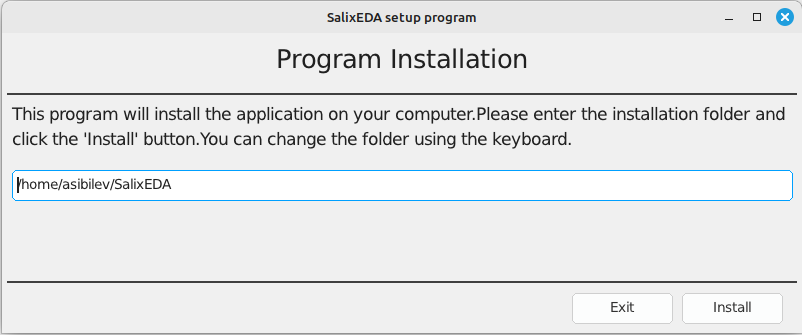

<!--Prev windows-->
# Installation on Linux

Currently, 64-bit Linux operating systems are supported.

There are no special computer requirements. The SalixEDA system will run on any office computer with a screen resolution of at least 1920x1080.

It will also work on monitors with lower resolution, but the toolbars will not fit completely on the screen, which is very inconvenient for work.

Using a mouse is strongly recommended. Trackpads and trackballs will also work, but for a graphical application where the main work is done with a mouse, this will be very inconvenient.

Therefore, using laptops for SalixEDA work should be avoided simply because it is inconvenient, unless used for demonstration purposes or for "field" work.

## Minimum Requirements
- Linux 64-bit
- Processor: 2-core, 2.0 GHz
- RAM: 2 GB
- Disk space: 200 MB
- Screen resolution: 1280x720

## Preparation for Installation
Download the installer program from the official website [SalixEDA](/download).

Change the permissions for the downloaded file. You need to give it execute permission.
```bash
chmod +x SalixEDA
```
## Installation

Run the downloaded installer program.

When the installer program starts, you should see a window with the installation
path for SalixEDA. Leave this path as default or change it to your own. Then
click the Install button.

Important! Do not specify Linux system paths as the installation path. Remember
file permissions.



The installation process will begin. Upon successful completion of the installation,
the SalixEDA program will start automatically.

## Installation Process Description

The installer program prepares a directory for SalixEDA in the location you
specified. Then the installer program downloads a set of zip files from the
official website that contain the SalixEDA system components. After downloading
the zip files, the file extraction process begins. Finally, shortcuts are created
in the Start menu or its equivalent depending on your system.

## Uninstalling SalixEDA

There is a separate program for uninstalling SalixEDA. It is installed during
the installation process. Its shortcut is placed in the Start menu. Simply select
this program from the Start menu. You can also run the uninstaller program manually.

