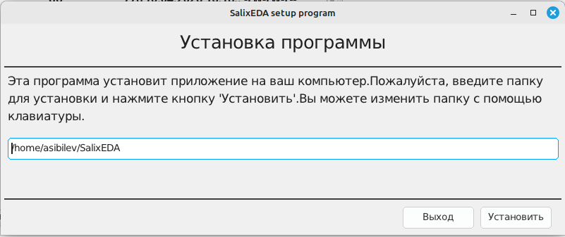

<!--Prev windows-->
# Установка в Linux

В настоящее время поддерживаются 64-разрядные операционные системы Linux.

Особых требований к компьютеру не предъявляется. Система SalixEDA будет работать на
любом оффисном компьютере с разрешением экрана не хуже 1920х1080.

На мониторах с меньшим разрешением тоже будет работать, но панели инструментов не
будут полностью влезать в экран, а это очень не удобно для работы.

Настоятельно рекомендуется использовать мышь. Трэкпад и трэкбол тоже будут работать,
но для графического приложения, где основная работа производится мышью, - это будет
очень не удобно.

Поэтому использование ноутбуков для работы SalixEDA следует избегать просто из-за
того, что это неудобно, если только не использовать их в демонстрационных целях или
для работы в "поле".

## Минимальные требования
- Linux 64
- Процессор: 2-ядерный, 2.0 GHz
- Оперативная память: 2 ГБ
- Место на диске: 200 МБ
- Разрешение экрана: 1280х720

## Подготовка к установке
С официального сайта скачайте программу-установщик [SalixEDA](/download).

Измените права для скачанного файла. Нужно дать ему разрешение на исполнение.
```bash
chmod +x SalixEDA
```
## Установка
Запустите скачанную программу-установщик.

Когда программа-установщик запустится, вы должны увидеть окошко с путем для установки
SalixEDA. Оставьте этот путь по умолчанию или измените на свой. После этого нажмите
кнопку Установить.

**Важно!** Не указывайте в качестве пути установки системные пути linux. Помните о
правах доступа.



Начнется процесс установки. При успешном завершении установки программа SalixEDA запустится
автоматически.

## Описание процесса
Программа установщик подготавливает директорий для размещения SalixEDA в указанном
вами месте. Затем программа установщик скачивает с официального сайта набор zip файлов, в которых находятся
компоненты системы SalixEDA. После скачивания zip-файлов начинается процесс разархивирования
файлов. В заключение формируются ярлыки в меню Пуск или его аналоге в зависимости
от вашей системы.

## Удаление SalixEDA
Для удаления SalixEDA есть отдельная программа. Она устанавливается в процессе установки.
Ее ярлык размещается в меню Пуск. Просто выберите эту программу в меню Пуск. Также
можно программу деинсталляции запустить вручную.

