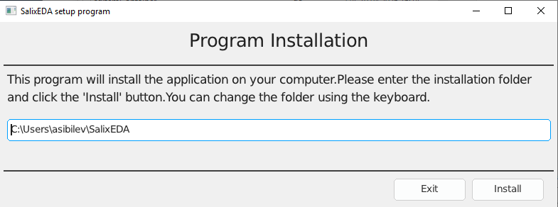

<!--Prev intro--> <!--Next linux-->
# Installation on Windows

Currently, 64-bit Windows operating systems starting from Windows 10 are supported.

**Important!** 32-bit versions are not supported.

There are no special computer requirements. The SalixEDA system will run on any office computer with a screen resolution of at least 1920x1080.

It will also work on monitors with lower resolution, but the toolbars will not fit completely on the screen, which is very inconvenient for work.

Using a mouse is strongly recommended. Trackpads and trackballs will also work, but for a graphical application where the main work is done with a mouse, this will be very inconvenient.

Therefore, using laptops for SalixEDA work should be avoided simply because it is inconvenient, unless used for demonstration purposes or for "field" work.

## Minimum Requirements
- Windows 10 and later
- Processor: 2-core, 2.0 GHz
- RAM: 2 GB
- Disk space: 200 MB
- Screen resolution: 1280x720

## Preparation for Installation
Download the installer program from the official website [SalixEDA](/download).

There are two main options for downloading this program:
- Direct download. You receive the directly executable file SalixEDA.exe
- Download via archive. You download an archive with the executable file SalixEDA.zip, which contains the executable file SalixEDA.exe.

These two options are completely equivalent. The archive contains exactly the same program that is available via direct download. The reason for the two options is that due to specific firewall settings on your computer, downloading via archive may be the only working option.

If you downloaded the archive, you should extract it to any location. In the end, you will get the executable file SalixEDA.exe.

## Installation
Run the downloaded installer program.

**Warning!** Depending on your computer's settings, you may receive a message about an unknown publisher when launching. Select the "Run anyway" option. If that option is not available in your case, try downloading the installer program via archive, see Preparation for Installation.

When the installer program starts, you should see a window with the installation path for SalixEDA. Leave this path as default or change it to your own. Then click the Install button.

**Important!** Do not specify Windows system paths as the installation path.

The installation process will begin. Upon successful completion of the installation, the SalixEDA program will start automatically.

## Installation Process Description
The installer program prepares a directory for SalixEDA in the location you specified. Then the installer program downloads a set of zip files from the official website that contain the SalixEDA system components. After downloading the zip files, the file extraction process begins. Finally, shortcuts are created in the Start menu.

## Uninstalling SalixEDA
There is a separate program for uninstalling SalixEDA. It is installed during the installation process. Its shortcut is placed in the Start menu. Simply select this program from the Start menu.

