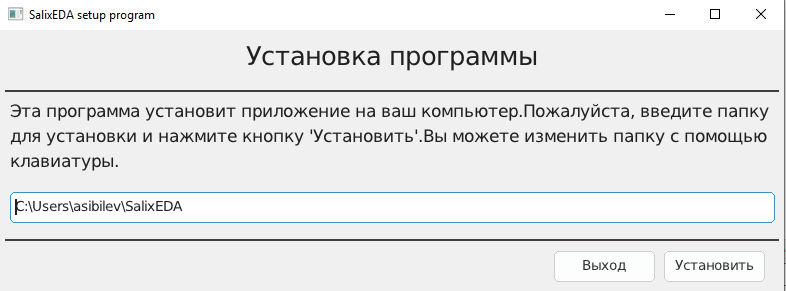

<!--Prev intro--> <!--Next linux-->
# Установка в Windows
В настоящее время поддерживаются 64-разрядные операционные системы Windows начиная
с Windows 10.

**Важно!** 32-разрядные версии не поддерживаются.

Особых требований к компьютеру не предъявляется. Система SalixEDA будет работать на
любом оффисном компьютере с разрешением экрана не хуже 1920х1080.

На мониторах с меньшим разрешением тоже будет работать, но панели инструментов не
будут полностью влезать в экран, а это очень не удобно для работы.

Настоятельно рекомендуется использовать мышь. Трэкпад и трэкбол тоже будут работать,
но для графического приложения, где основная работа производится мышью, - это будет
очень не удобно.

Поэтому использование ноутбуков для работы SalixEDA следует избегать просто из-за
того, что это неудобно, если только не использовать их в демонстрационных целях или
для работы в "поле".

## Минимальные требования
- Windows 10 и старше
- Процессор: 2-ядерный, 2.0 GHz
- Оперативная память: 2 ГБ
- Место на диске: 200 МБ
- Разрешение экрана: 1280х720

## Подготовка к установке
С официального сайта скачайте программу-установщик [SalixEDA.exe](/download).

Есть два основных варианта скачивания этой программы:
- Прямое скачивание. Вы получаете непосредственно запускаемый файл SalixEDA.exe
- Скачивание через архив. Вы скачиваете архив с запускаемым файлом SalixEDA.zip, в
котором расположен запускаемый файл SalixEDA.exe.

Эти два варианта полностью равнозначны. В архиве расположена точно такая-же программа,
которая доступна по прямому скачиванию. Причина двух вариантов в том, что из-за конкретных
настроек брэндмауэра вашего компьютера скачивание через архив может оказаться единственным
рабочим вариантом.

Если Вы скачали архив, то Вам следует разархивировать его в любое место. В конечном
итоге Вы получите запускаемый файл SalixEDA.exe.

## Установка
Запустите скачанную программу-установщик.

**Предупреждение!** В зависимости от настроек вашего компьютера при запуске Вы можете
получить сообщение о неизвестном издателе. Выберите вариант "Принять риск и продолжить".
Если такого варианта нет в вашем случае, тогда попробуйте скачать программу-установщик
через архив, см.Подготовка к установке.

Когда программа-установщик запустится, вы должны увидеть окошко с путем для установки
SalixEDA. Оставьте этот путь по умолчанию или измените на свой. После этого нажмите
кнопку Установить.

**Важно!** Не указывайте в качестве пути установки системные пути windows.

Начнется процесс установки. При успешном завершении установки программа SalixEDA запустится
автоматически.

## Описание процесса
Программа установщик подготавливает директорий для размещения SalixEDA в указанном
вами месте. Затем программа установщик скачивает с официального сайта набор zip файлов, в которых находятся
компоненты системы SalixEDA. После скачивания zip-файлов начинается процесс разархивирования
файлов. В заключение формируются ярлыки в меню Пуск.

## Удаление SalixEDA
Для удаления SalixEDA есть отдельная программа. Она устанавливается в процессе установки.
Ее ярлык размещается в меню Пуск. Просто выберите эту программу в меню Пуск.
