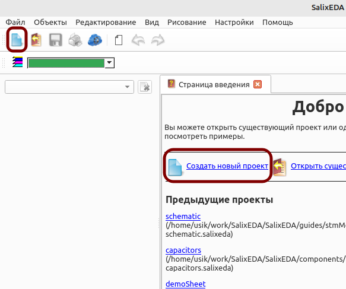
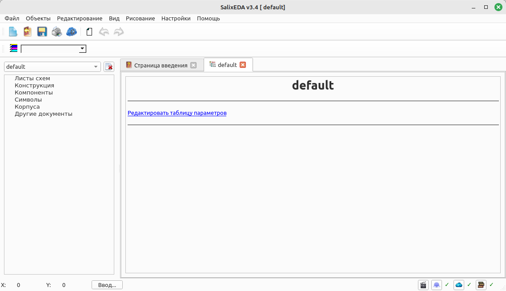
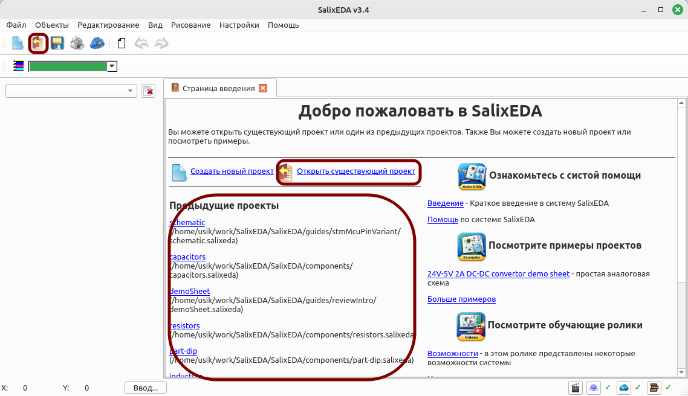
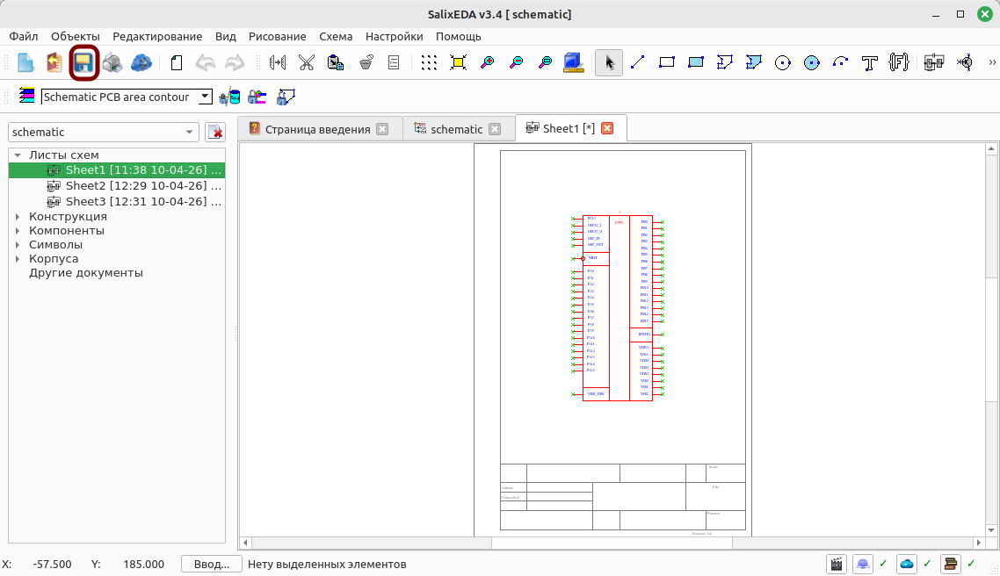

# Операции с проектом
В данном разделе приведены основные операции, которые можно выполнять с проектом.
- [Создание](#mk3) нового проекта
- [Открытие](#mk4) существующего проекта
- [Сохранение](#mk5) проекта
- [Сохранение](#mk6) проекта с присвоением имени

## Создание нового проекта
Чтобы создать новый проект нажмите на кнопку, как показано на рисунке или выберите
пункт меню Файл|Новый проект.

При этом создается проект. Для него открывается окно с деревом проекта и можно создавать
объекты проекта.

## Открытие существующего проекта
Чтобы открыть существующий проект есть несколько возможностей. Вы можете выбрать из
списка недавно открытых проектов, нажать кнопку, как показано на рисунке и выбрать
проект в диалоговом режиме среди файлов на диске или выбрать пункт меню Файл|Открыть
проект.

## Сохранение проекта
Если у проекта есть имя, то сохранить его можно в любой момент нажав на кнопку, как
показано на рисунке или выбрать пункт меню Файл|Сохранить проект. Если у проекта еще
нет имени, то автоматически будет предложено его ввести и указать месторазмещения
для файла проекта.

## Сохранение проекта с присвоением имени
Чтобы сохранить проект в файл с новым именем выберите пункт меню Файл|Сохранить проект
как... При этом появляется диалоговое окно, где нужно указать место размещения файла
проекта и ввести новое имя для файла проекта.
