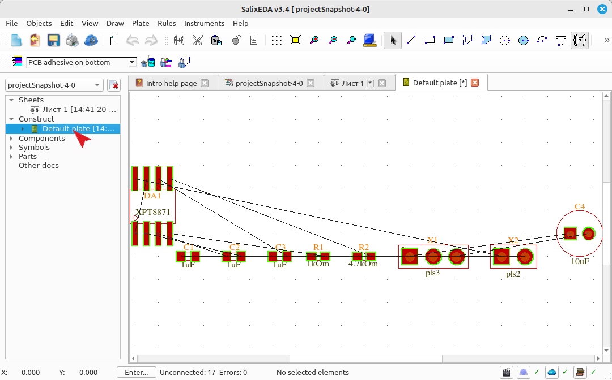
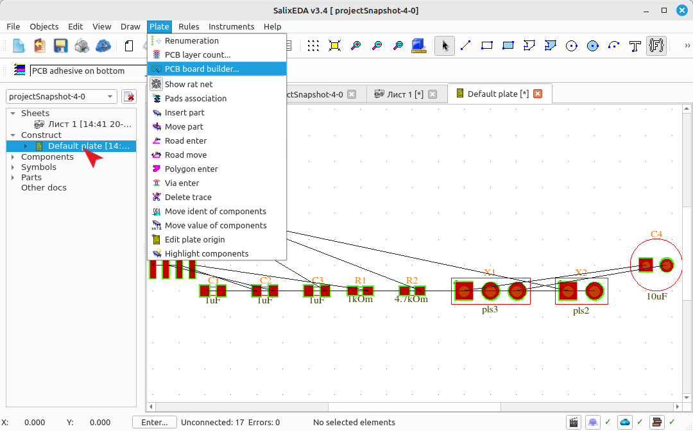
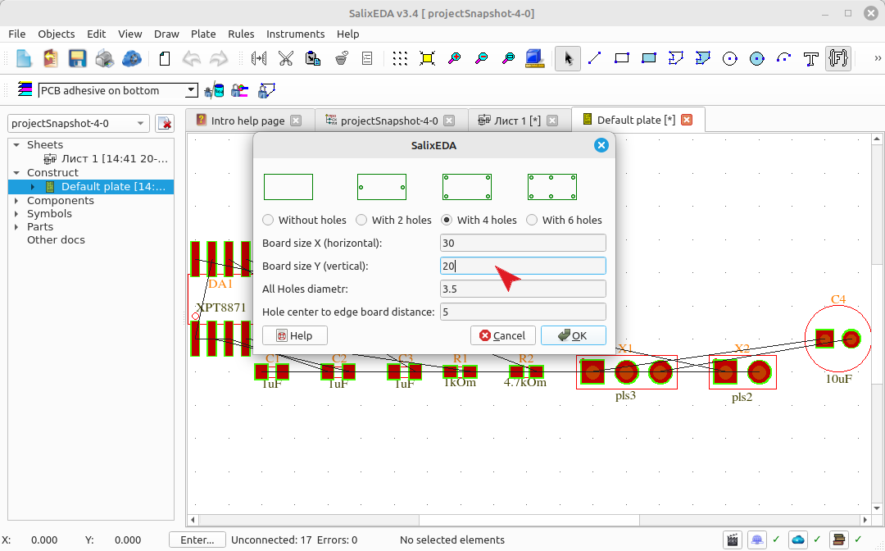
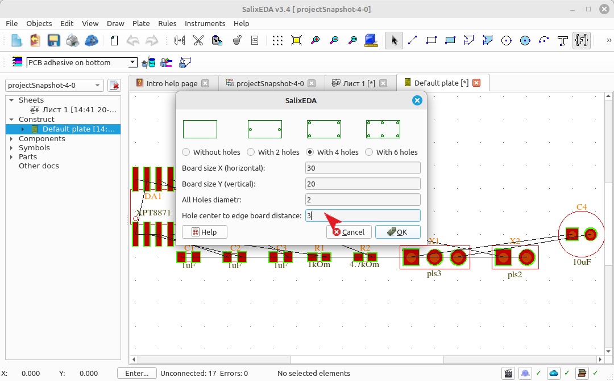
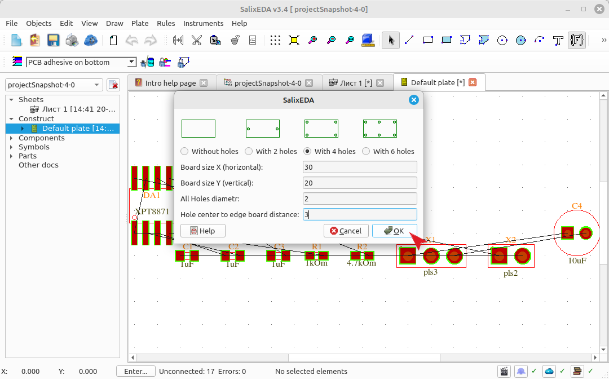
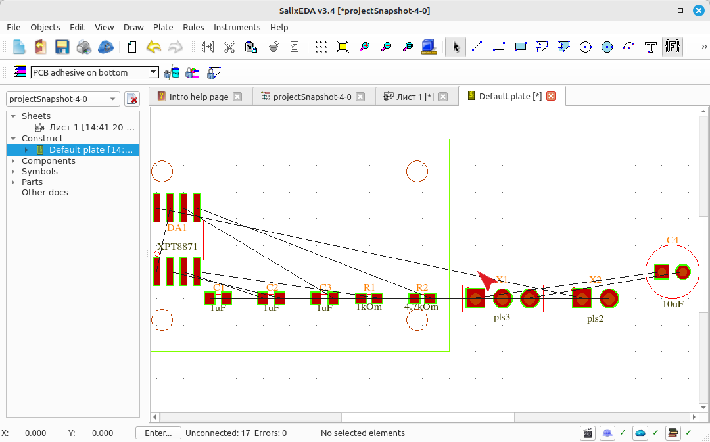

<!--Prev sheetForm--> <!--Next compPlace-->
<!--Zoomed true-->
# Creating the PCB outline
## Switching to the PCB
To open the PCB editor, expand the Design list in the project tree, which
is located on the left. In this list, select Default plate - the default PCB. This
will open the PCB editor.

## Creating the PCB outline using the wizard
Before placing components, you need to define the PCB outline. This can be done manually
by simply drawing the outline using a closed contour or a rectangle.

For accelerated outline creation along with mounting holes, there is a special
PCB Constructor. To launch the wizard, select the Board menu item,
and within it, the PCB Constructor sub-item.

In the dimensions fields, set the PCB dimensions.

In the mounting holes fields, enter the parameters for the mounting holes. These are the diameter and
distance to the PCB edges.

To complete the wizard, click this button.

The result should look like this.

