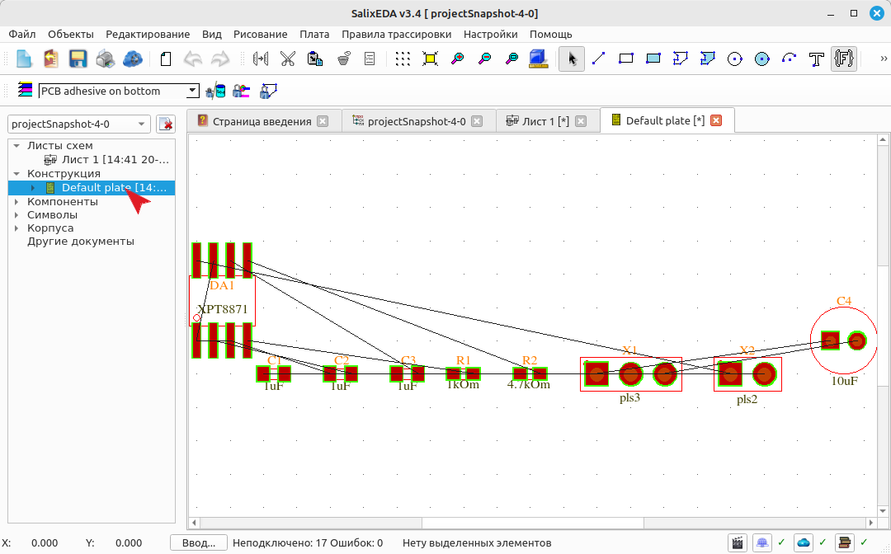
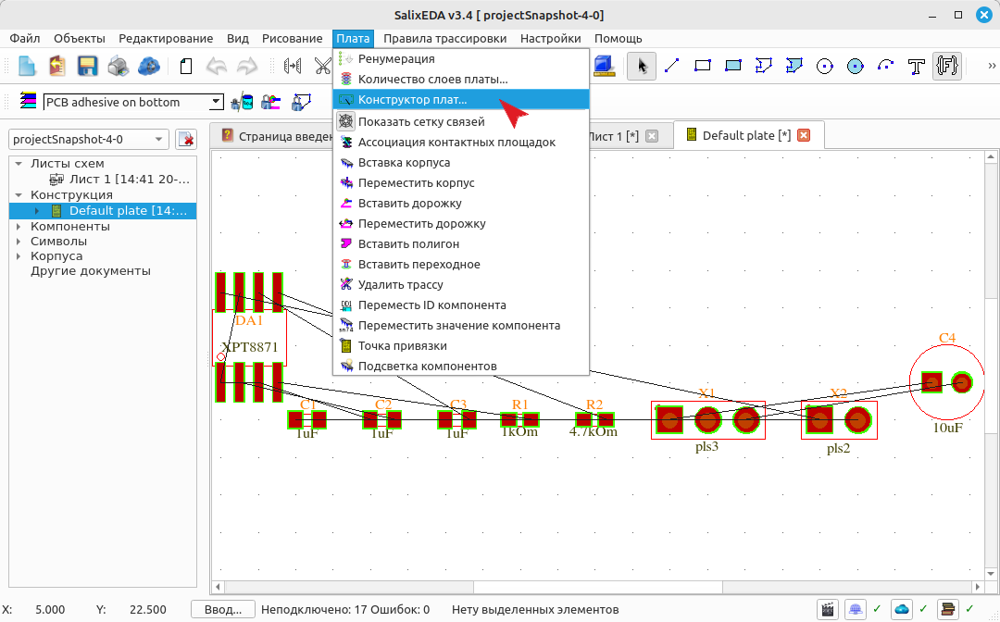
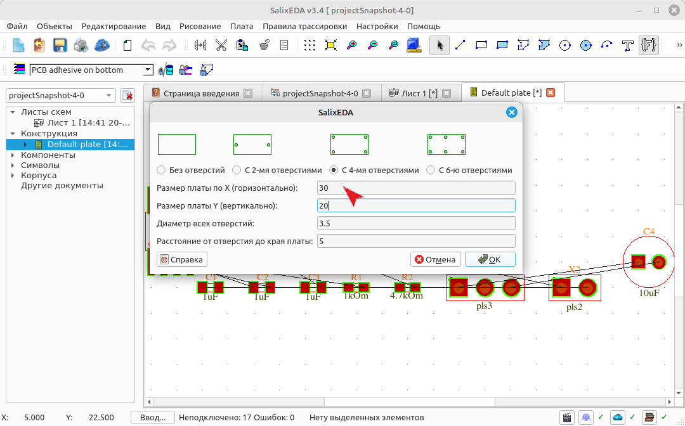
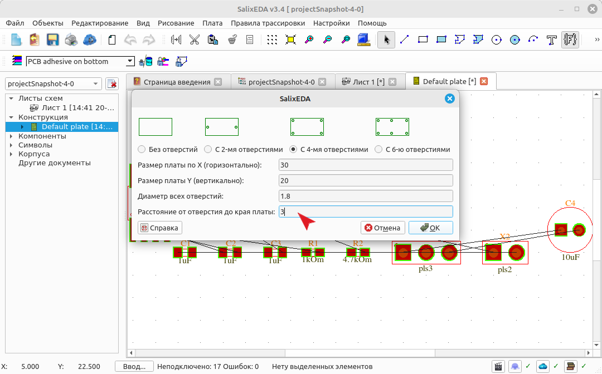
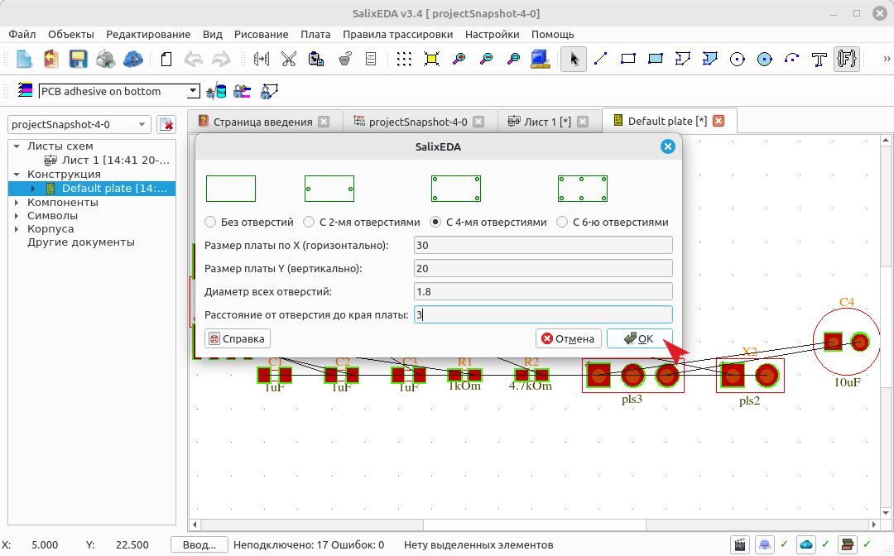
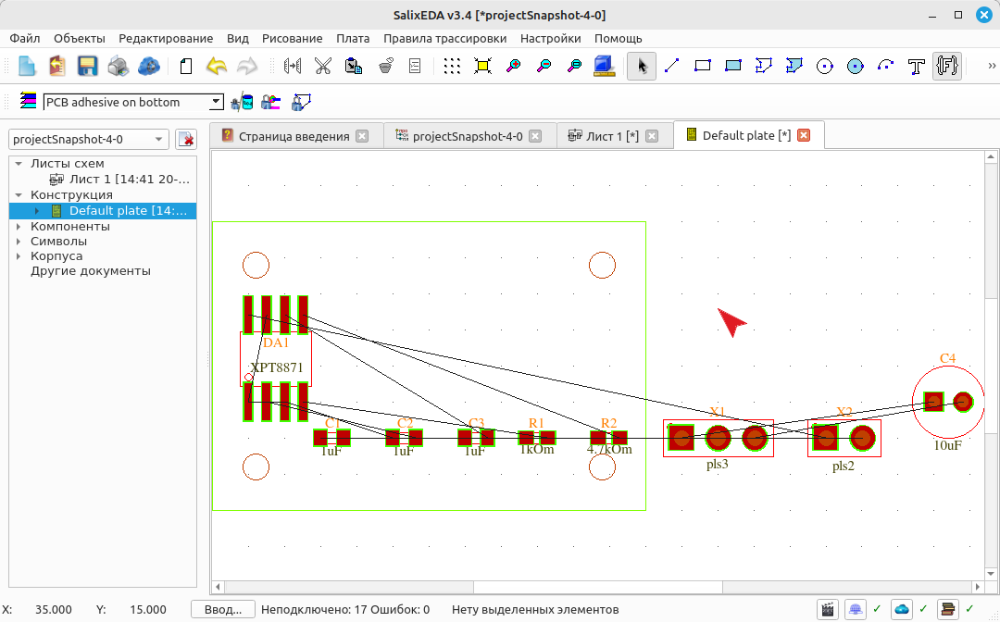

<!--Prev sheetForm--> <!--Next compPlace-->
<!--Zoomed true-->
# Создание контура платы
## Переход к плате
Чтобы открыть редактор платы раскройте список Конструкция в дереве проекта, который
расположен слева. В этом списке выберите Default plate - плата по умолчанию. При
этом откроется редактор платы.

## Создание контура платы с помощью мастера
Перед расстановкой компонентов нужно определить контур платы. Сделать это можно вручную
просто нарисовав контур с помощью замкнутого контура или прямоугольника.

Для ускоренного задания контура вместе с крепежными отверстиями служит специальный
Конструктор плат. Чтобы запустить мастер выберите пункт меню Плата,
а в нем - подпункт Конструктор плат.

В полях размеры задайте габариты платы.

В полях крепежные отверстия введите параметры крепежных отверстий. Это диаметр и
расстояние до краев платы.

Для завершения мастера нажмите на эту кнопку.

При этом должен получиться такой результат.

