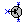
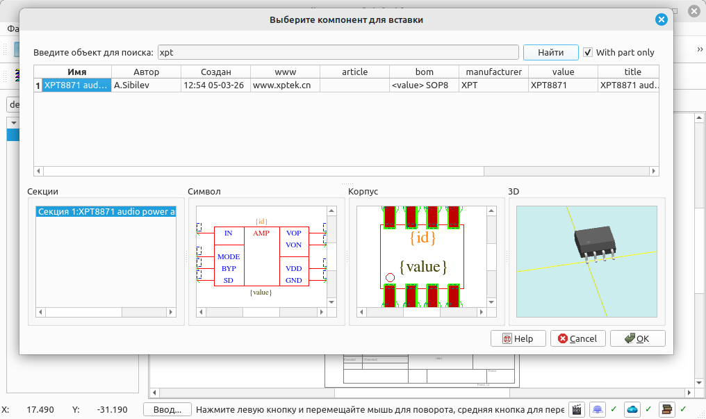
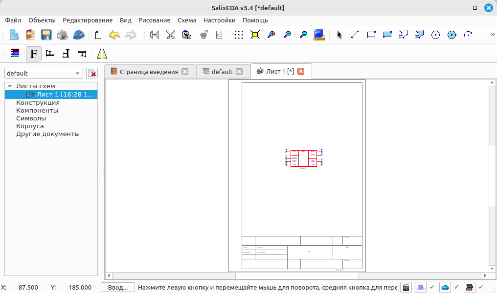
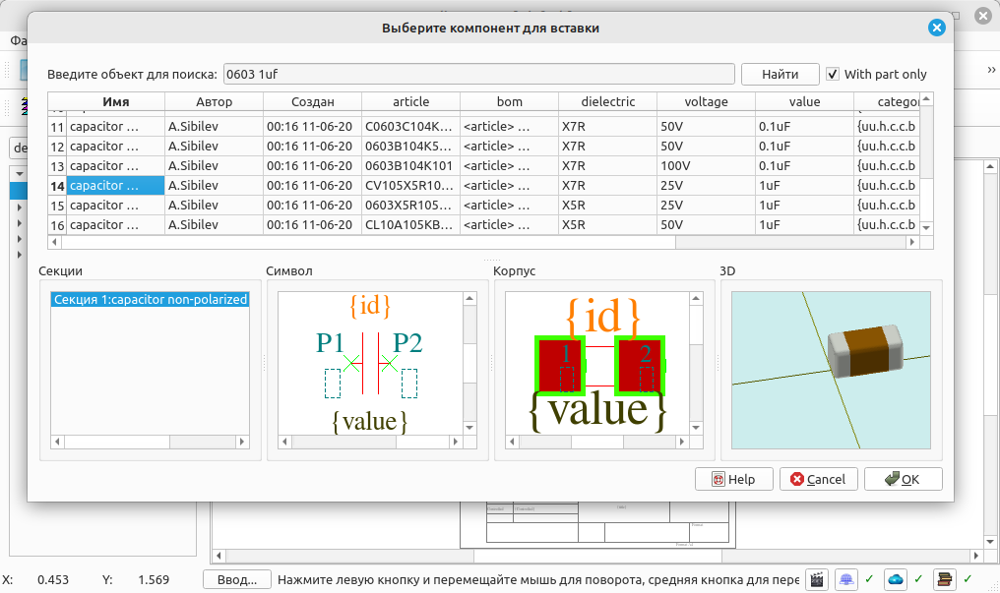
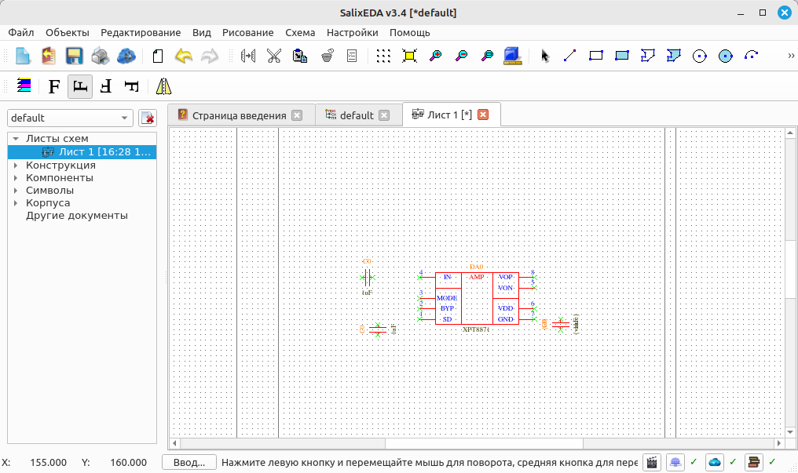
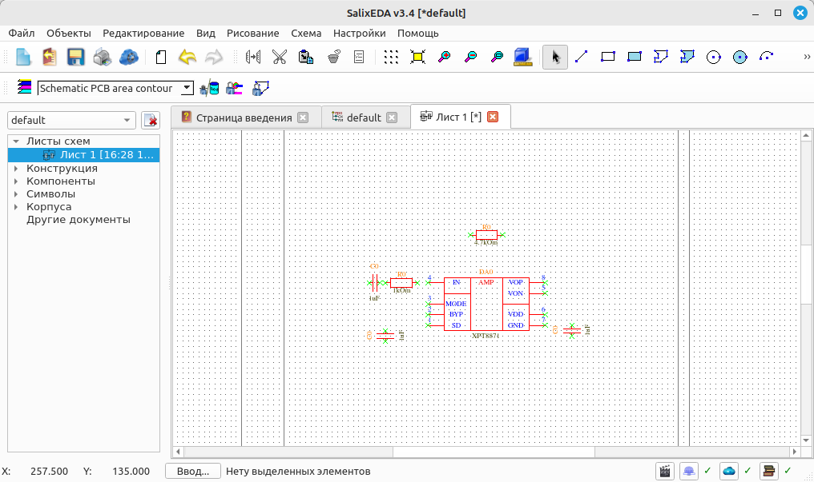
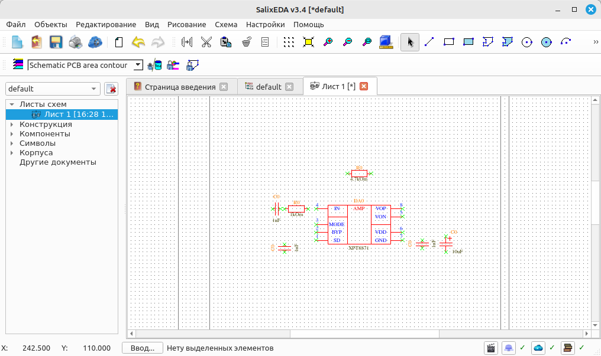
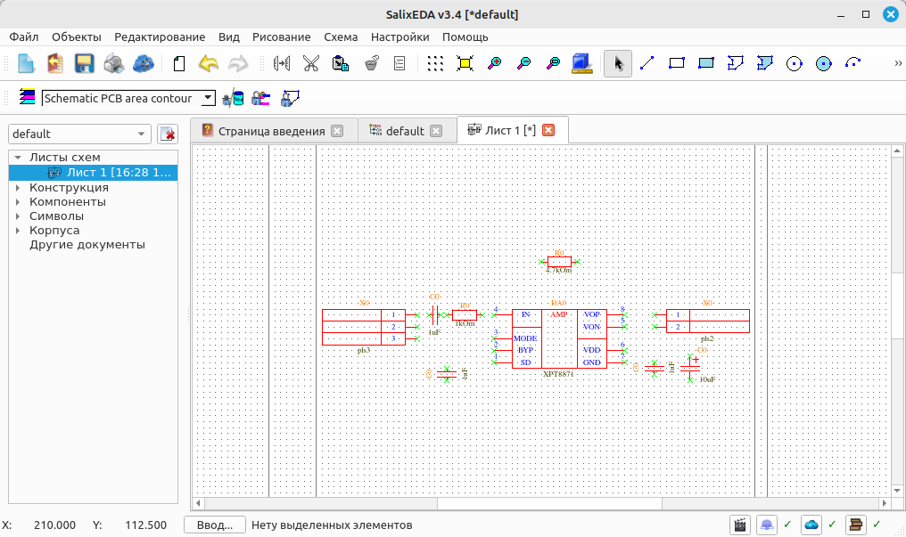

<!--Prev newProject--> <!--Next insertNet-->
# Вставка компонентов из библиотеки в схему

Для включения режима вставки компонентов нажмите такую кнопку 
или выберите пункт меню Схема|Вставить компонент.

При этом появляется диалоговое окно поиска компонентов по библиотеке:

В поле "Введите объект для поиска" введите "xpt" и нажмите Enter. При этом в списке
обнаруженных объектов будет микросхема XPT8871. Нажмите на нее левой кнопкой мыши.
В нижней части окна поиска появятся предварительный просмотр для выбранного компонента:
его список секций, а изображение текущей секции будет показано в окне Символ. В окне
корпус будет показано графическое изображение корпуса компонента. В окне 3D - объемное
изображение корпуса компонента.

Нажмите ОК для вставки выбранной секции выбранного компонента в схему. При этом окно
поиска компонентов убирается и можно мышью указать местоположение вставки компонента.

Каждое нажатие левой кнопки мыши вызывает вставку текущего компонента в место, куда
указывает курсор мыши. Таким образом, за один разм можно вставить всю группу одинаковых
компонентов. Для прекращения вставки нажмите правую кнопку мыши. При этом снова открывается
диалог выбора компонентов.

Теперь в поле "Введите объект для поиска" введите "0603 1uf". Данный запрос означает,
что будут найдены все компоненты, в названии или параметрах которых есть 0603 и 1uf
одновременно. Появится большой список, в котором будут конденсаторы с емкостью 0.1uf,
0.01uf и 1uf. Это нормально и происходит потому, что поиск осуществляется по части
имени или параметра. Имейте это ввиду при задании шаблона поиска.

Выберите в списке конденсатор именно с емкостью 1uf. Снова в списке секций представлен
список доступных секций компонента (в данном случае в компоненте всего одна секция),
в окне Символ представлено схемное изображение выбранной секции, в окне Корпус - представлено
изображение корпуса компонента, а в окне 3D - объемное представление компонента. Нажмите
ОК и расставьте конденсаторы в соответствии с примером ниже.

Для поворота компонента используйте панель свойств компонента 
  . Текущая ориентация
показана буквой F.

Нажмите правую кнопку мыши. И в поиске введите 0603 1k выберите резистор с номиналом
1кОм и разместите на схеме. Затем в поиске введите 0603 4.7k и тоже разместите на
схеме.

Введите в поиске 16v 10uf, в появившемся списке выберите capacitor leaded и разместите
его на схеме.

Введите в поиске pls3, в появившемся списке выберите connector pls3. Разместите его
на схеме. По умолчанию, данный разъем направлен вправо. В данном конкретном случае
нужно направить его налево. Это делается с помощью зеркальности компонента, это значок
. Используйте его чтобы включать и отменять зеркальное
отображение компонента.

В заключение введите в поиске pls2, в появившемся списке выберите connector pls2.
Разместите его на схеме.

