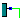

<!--Prev insertComp--> <!--Next sheetForm-->
# Вставка цепей в схему
Для включения режима вставки цепей в схему нажмите такую кнопку 
или выберите пункт меню Схема|Вставить цепь.

При движении мышью по схеме "разумный режим" предлагает провести цепь между выводами
в зависимости от положения курсора мыши.