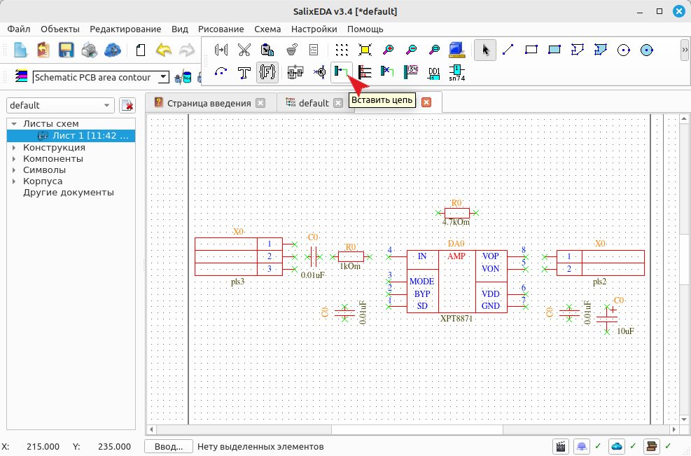
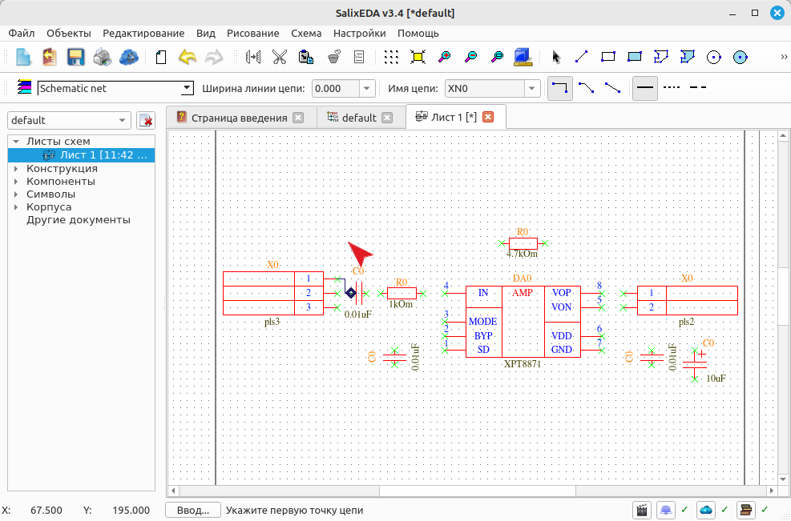
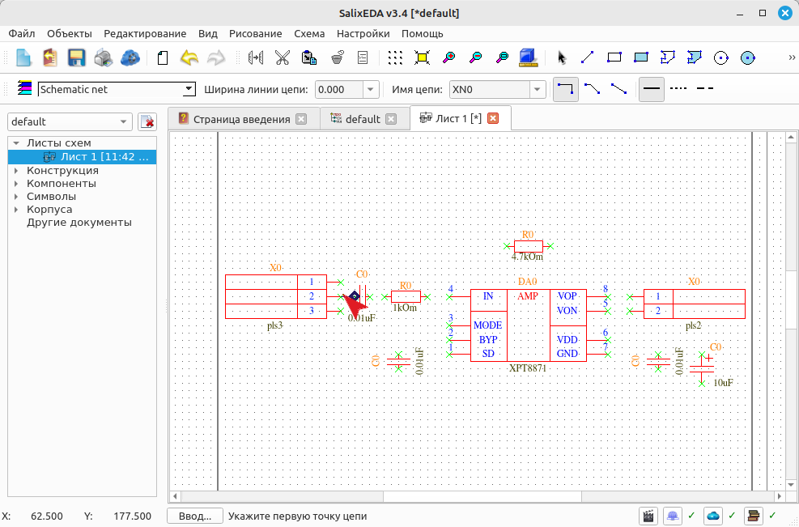
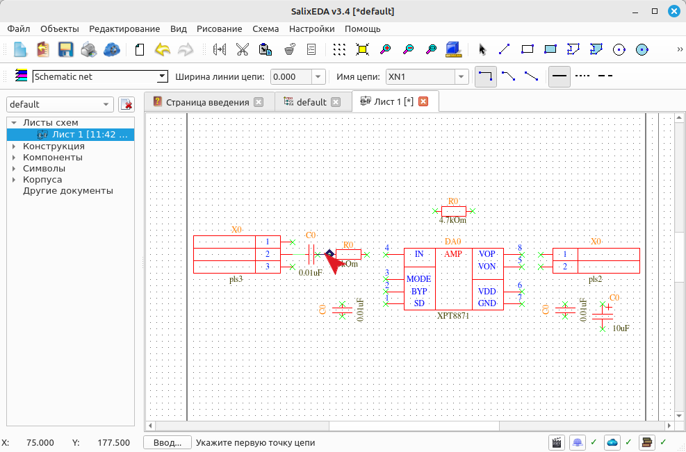
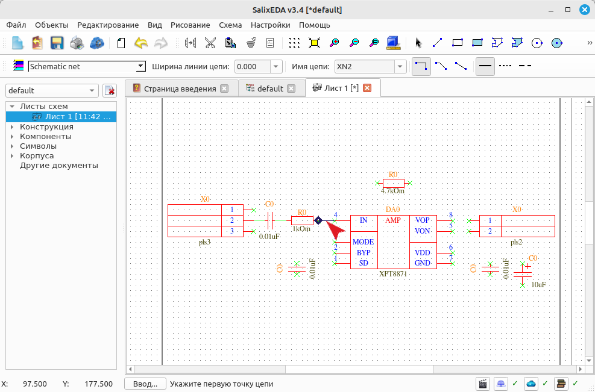
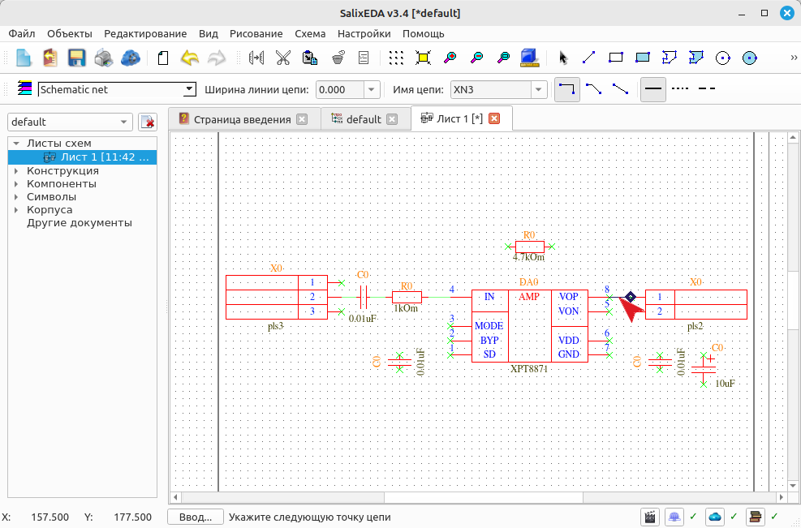
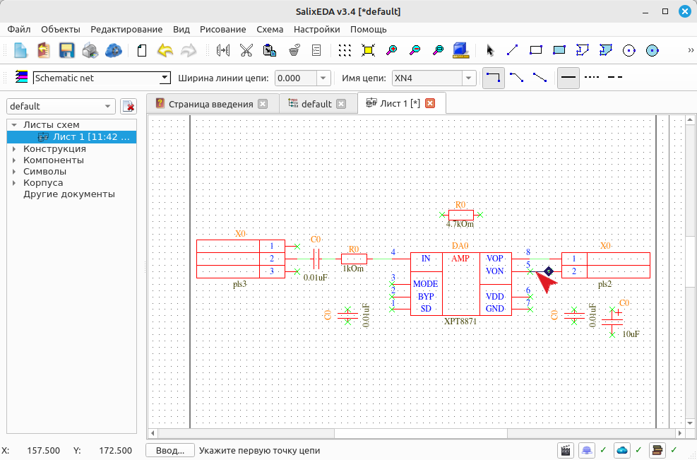
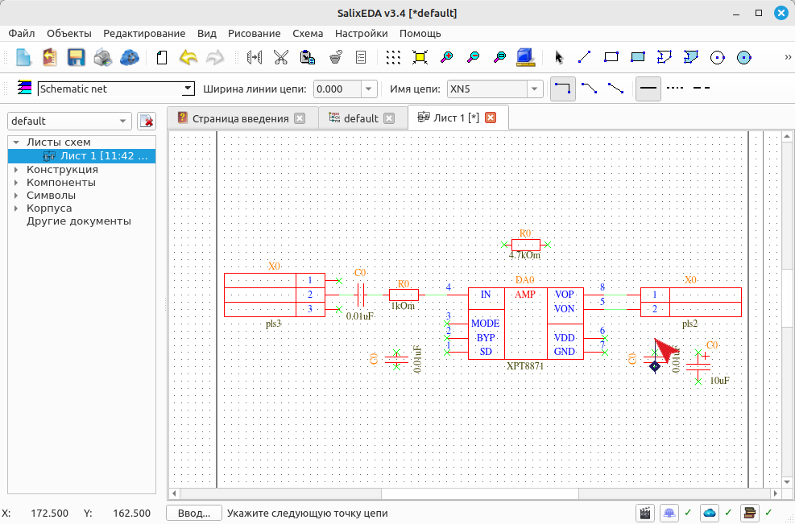

<!--Prev insertComp--> <!--Next sheetForm-->
<!--Zoomed true-->
# Вставка цепей в схему
Чтобы включить режим вставки цепей в схему нажмите на такую кнопку.

Цепь это просто ломаная линия, которая соединяет выводы компонентов. Начало, каждый
излом и конец ломаной вводятся левой кнопкой мыши. Чтобы прервать ввод ломаной нужно
нажать правую кнопку мыши.

Режим ввода цепей снабжен "разумным режимом". Этот режим предлагает целую цепь, если
ввод цепи еще не начат или предлагает завершение цепи, если ее ввод начат. Вы можете
согласиться с предложением, нажав среднюю кнопку мыши или продолжать вводить цепь
вручную и игнорировать предложение.

Перемещайте мышь и "разумный режим" будет предлагать провести цепь между выводами
в зависимости от положения курсора мыши.

Переместите мышь таким образом, чтобы "разумный режим" предложил цепь между контактом
2 разъема и конденсатором.

Нажмите среднюю кнопку мыши, чтобы согласиться с "разумным режимом". При этом вводится
предложенная цепь. Переместите мышь, чтобы разумный режим предложил следующую цепь.

Нажмите среднюю кнопку мыши, чтобы согласиться с "разумным режимом". При этом вводится
предложенная цепь. Переместите мышь, чтобы разумный режим предложил следующую цепь.

Нажмите среднюю кнопку мыши, чтобы согласиться с "разумным режимом". При этом вводится
предложенная цепь. Переместите мышь, чтобы разумный режим предложил следующую цепь.

Нажмите среднюю кнопку мыши, чтобы согласиться с "разумным режимом". При этом вводится
предложенная цепь. Переместите мышь, чтобы разумный режим предложил следующую цепь.

Нажмите среднюю кнопку мыши, чтобы согласиться с "разумным режимом". При этом вводится
предложенная цепь. Переместите мышь, чтобы разумный режим предложил следующую цепь.

