<!--Prev insertComp--> <!--Next sheetForm-->
<!--Zoomed true-->
# Вставка цепей в схему

## Включение режима вставки цепей
Чтобы включить режим вставки цепей в схему нажмите на такую кнопку.

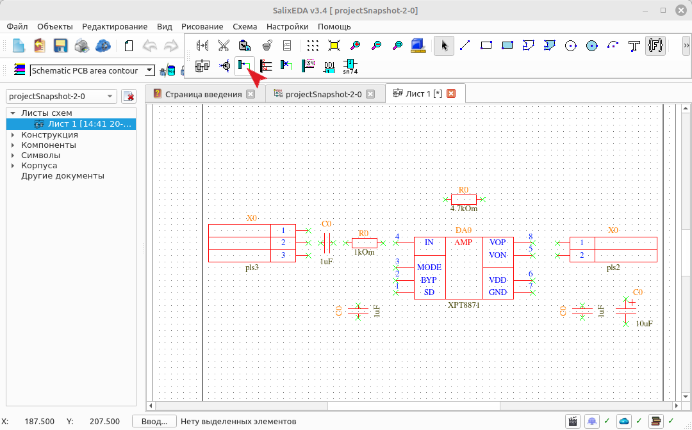

## Ввод цепей
Цепь это просто ломаная линия, которая соединяет выводы компонентов. Начало, каждый
излом и конец ломаной вводятся левой кнопкой мыши. Чтобы прервать ввод ломаной нужно
нажать правую кнопку мыши.

Режим ввода цепей снабжен "разумным режимом". Этот режим предлагает целую цепь, если
ввод цепи еще не начат или предлагает завершение цепи, если ее ввод начат. Вы можете
согласиться с предложением, нажав среднюю кнопку мыши или продолжать вводить цепь
вручную и игнорировать предложение.

## Ввод цепей разумным режимом
Перемещайте мышь и "разумный режим" будет предлагать провести цепь между выводами
в зависимости от положения курсора мыши.

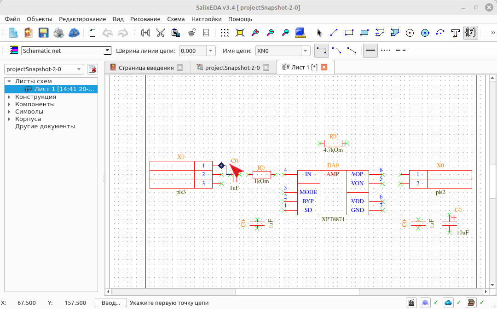

Переместите мышь таким образом, чтобы "разумный режим" предложил цепь между контактом
2 разъема и конденсатором.

Нажмите среднюю кнопку мыши, чтобы согласиться с "разумным режимом". При этом вводится
предложенная цепь. Переместите мышь, чтобы разумный режим предложил следующую цепь.

Нажмите среднюю кнопку мыши, чтобы согласиться с "разумным режимом". При этом вводится
предложенная цепь. Переместите мышь, чтобы разумный режим предложил следующую цепь.

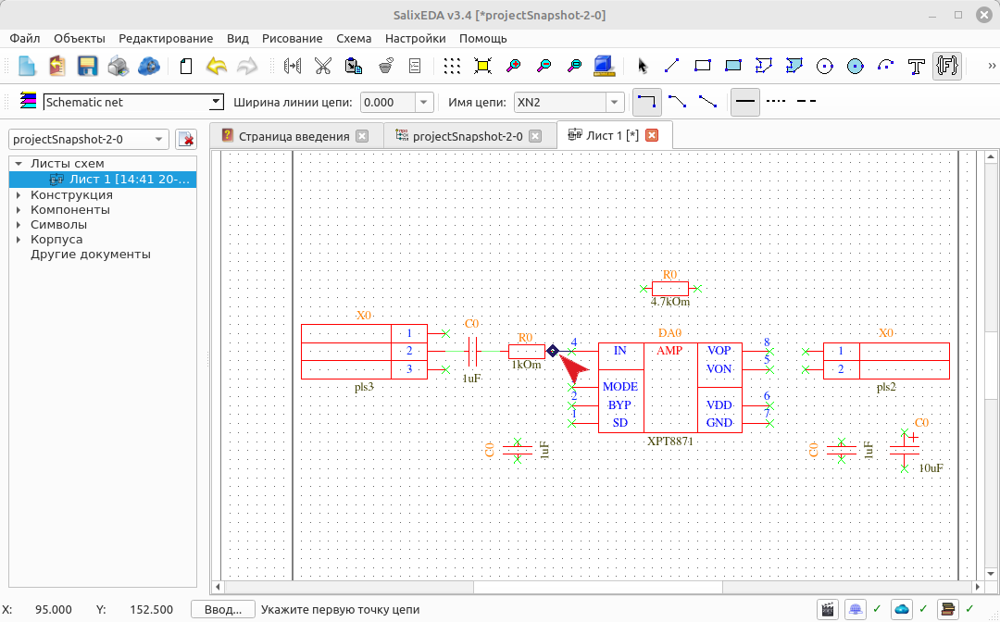

Нажмите среднюю кнопку мыши, чтобы согласиться с "разумным режимом". При этом вводится
предложенная цепь. Переместите мышь, чтобы разумный режим предложил следующую цепь.

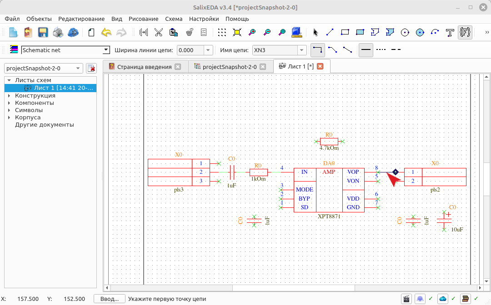

Нажмите среднюю кнопку мыши, чтобы согласиться с "разумным режимом". При этом вводится
предложенная цепь. Переместите мышь, чтобы разумный режим предложил следующую цепь.

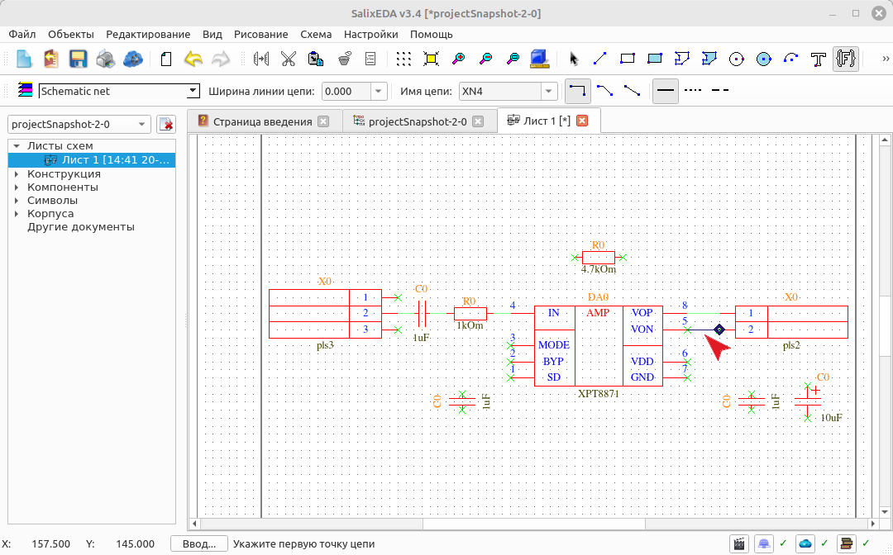

Нажмите среднюю кнопку мыши, чтобы согласиться с "разумным режимом". При этом вводится
предложенная цепь. Переместите мышь, чтобы разумный режим предложил следующую цепь.

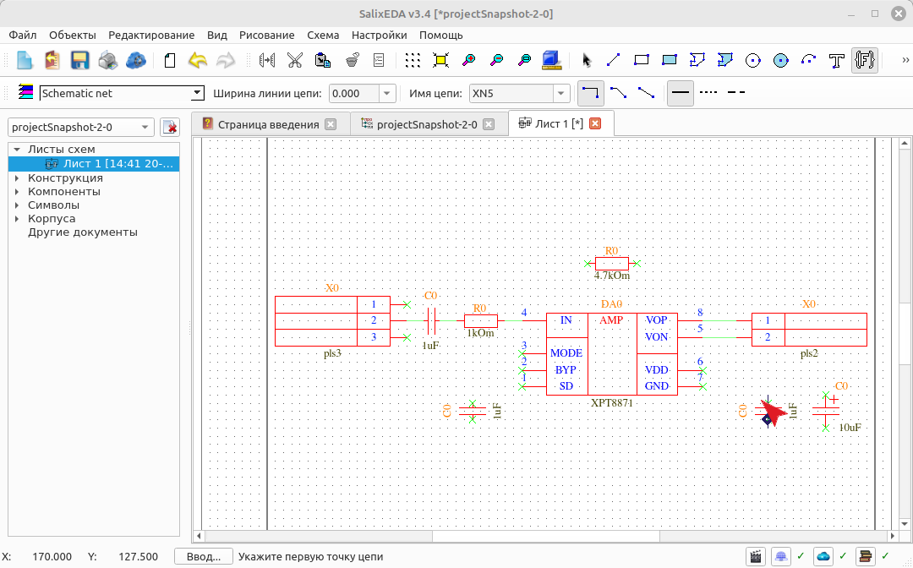

## Ручной ввод цепей
В случаях, когда конфигурация схемы не позволяет "разумному режиму" определить целую
цепь, следует начать ввод вручную. Наведите мышь на вывод конденсатора и нажмите левую
кнопку мыши, чтобы начать ввод ломаной цепи. Переместите мышь до следующего излома
и нажмите левую кнопку мыши, чтобы зафиксировать излом. Перемещайте мышь в направлении
завершающего вывода цепи и разумный режим предложит завершение цепи.

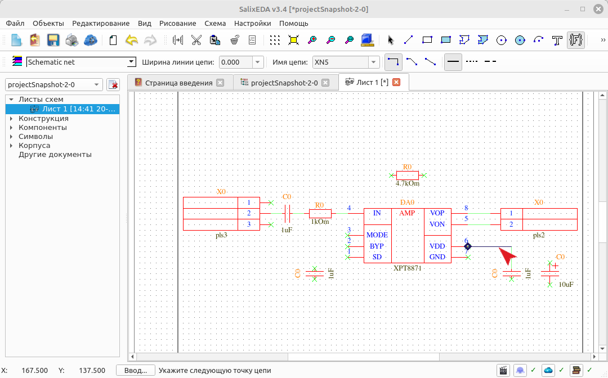

Нажмите среднюю кнопку, чтобы согласиться с предложением. Переместите мышь, чтобы
разумный режим предложил следующую цепь.

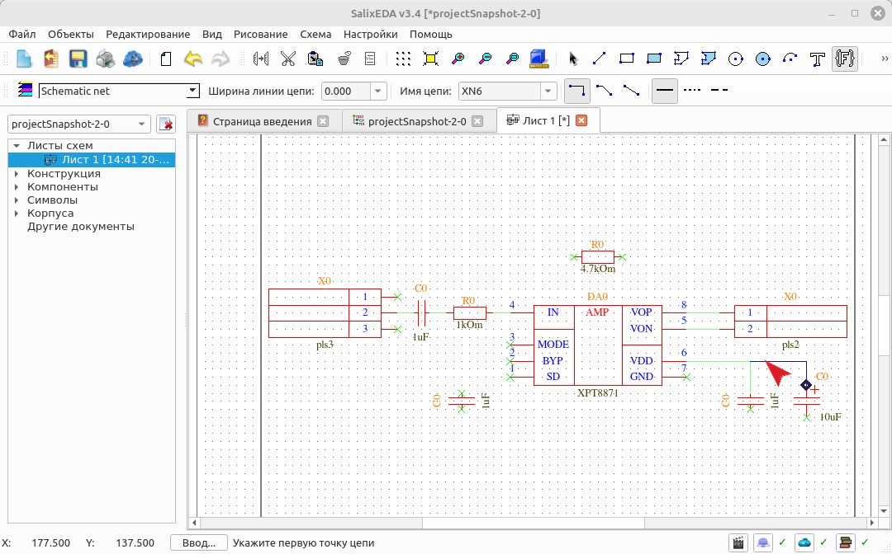

Нажмите среднюю кнопку мыши, чтобы согласиться с "разумным режимом". При этом вводится
предложенная цепь. Переместите мышь, чтобы разумный режим предложил следующую цепь.

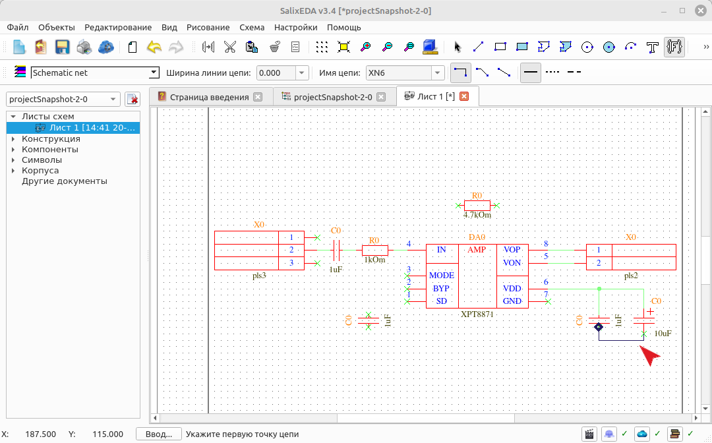

Нажмите среднюю кнопку мыши, чтобы согласиться с "разумным режимом". При этом вводится
предложенная цепь. Переместите мышь, чтобы разумный режим предложил следующую цепь.

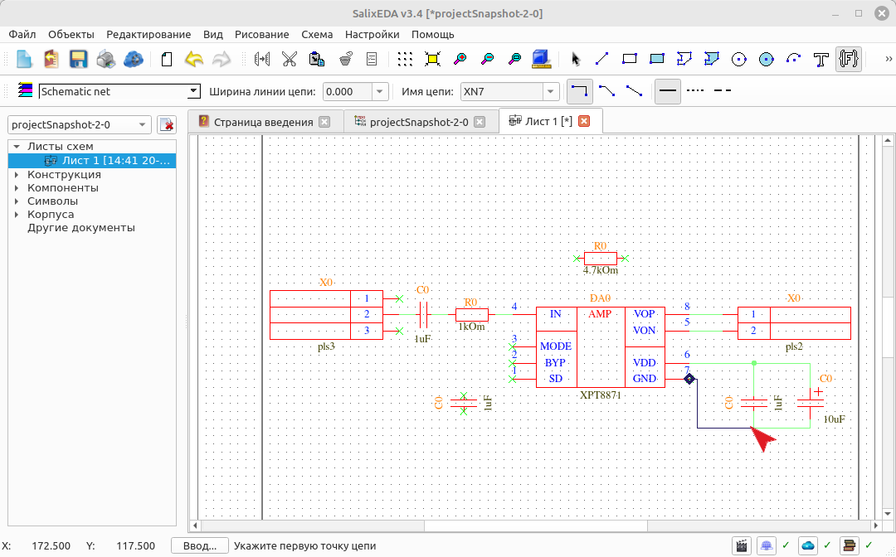

Нажмите среднюю кнопку мыши, чтобы согласиться с "разумным режимом". При этом вводится
предложенная цепь. Переместите мышь, чтобы разумный режим предложил следующую цепь.

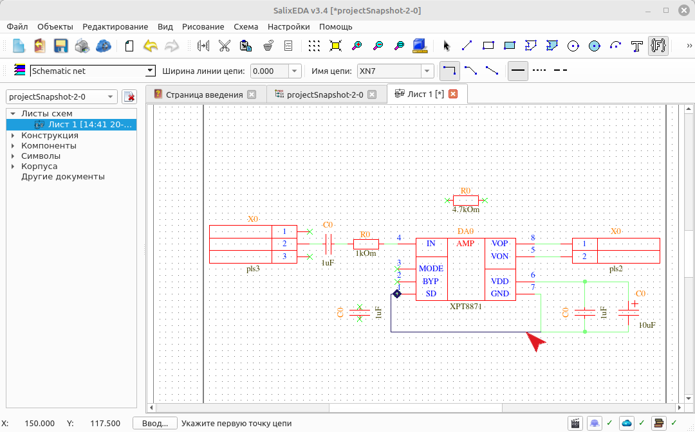

Нажмите среднюю кнопку мыши, чтобы согласиться с "разумным режимом". При этом вводится
предложенная цепь. Переместите мышь, чтобы разумный режим предложил следующую цепь.

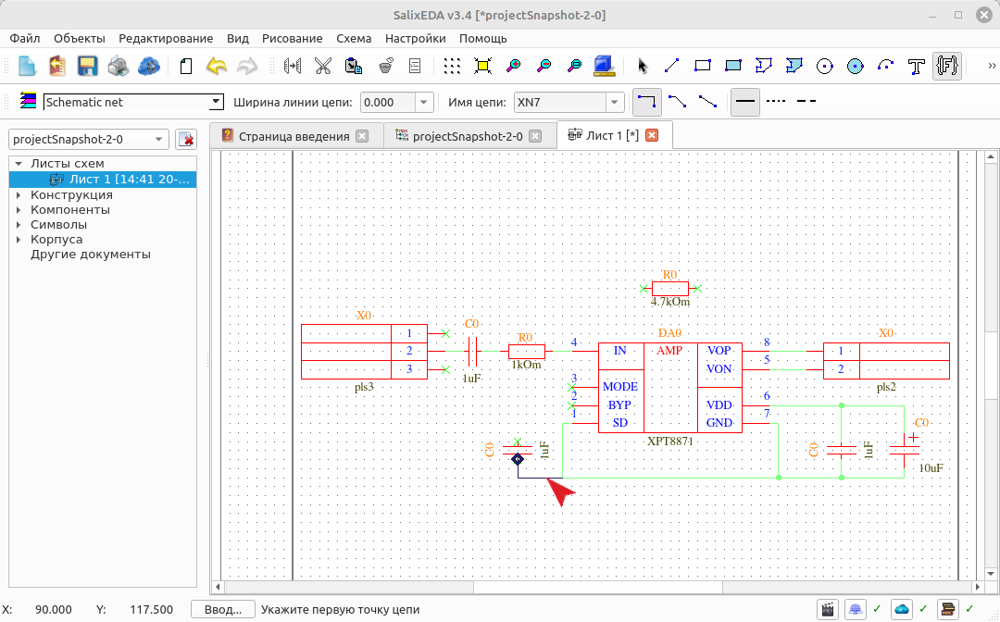

Нажмите среднюю кнопку мыши, чтобы согласиться с "разумным режимом". При этом вводится
предложенная цепь. Переместите мышь, чтобы разумный режим предложил следующую цепь.

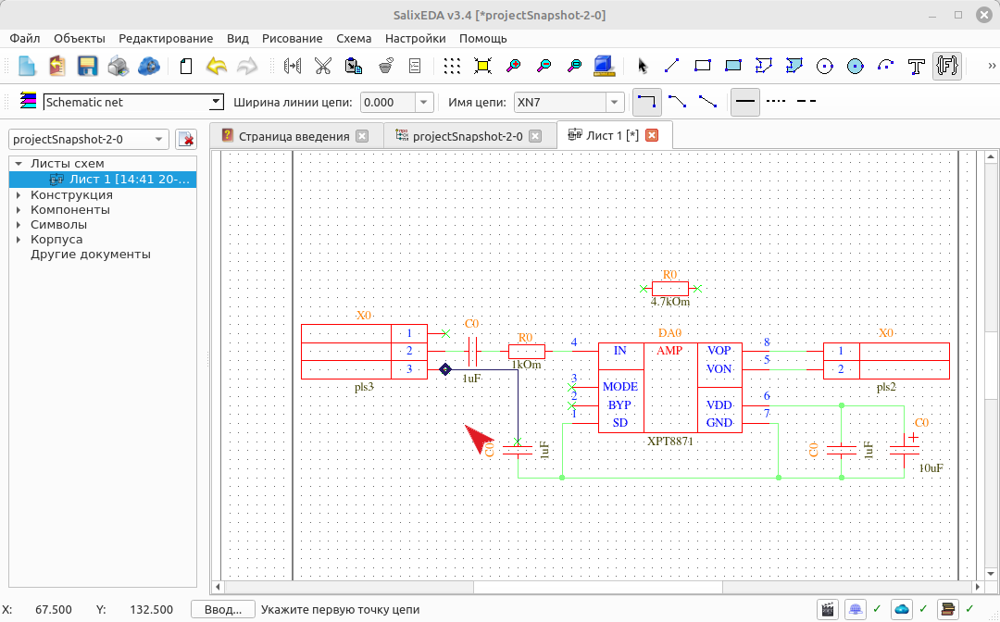

Здесь "разумный режим" снова не в состоянии проложить правильную цепь сразу. Наведите
мышь на излом цепи и нажмите левую
кнопку мыши, чтобы начать ввод ломаной цепи. Переместите мышь до следующего излома
и нажмите левую кнопку мыши, чтобы зафиксировать излом. Перемещайте мышь в направлении
завершающего вывода цепи и разумный режим предложит завершение цепи.

Нажмите среднюю кнопку мыши, чтобы согласиться с "разумным режимом". При этом вводится
предложенная цепь. Переместите мышь, чтобы разумный режим предложил следующую цепь.

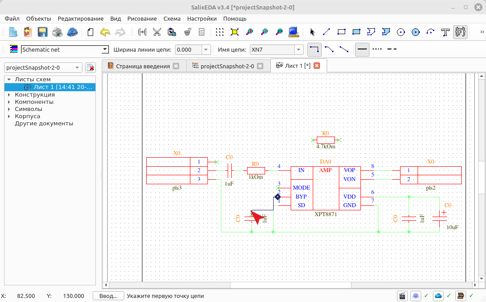

Здесь "разумный режим" снова не в состоянии проложить правильную цепь сразу. Наведите
мышь на верхний вывод конденсатора и нажмите левую
кнопку мыши, чтобы начать ввод ломаной цепи. Переместите мышь до следующего излома
и нажмите левую кнопку мыши, чтобы зафиксировать излом. Перемещайте мышь в направлении
завершающего вывода цепи и разумный режим предложит завершение цепи.

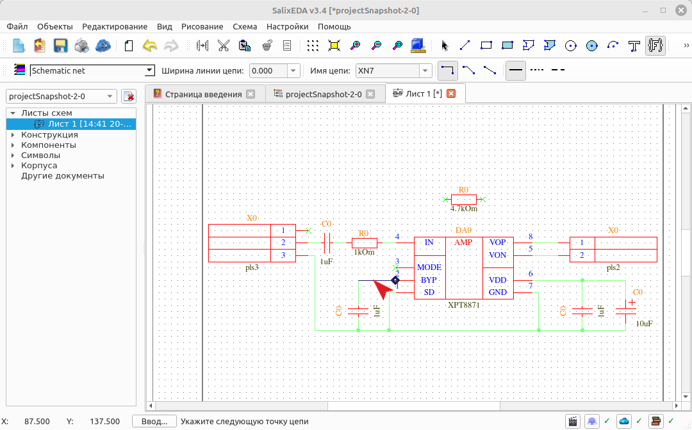

Нажмите среднюю кнопку мыши, чтобы согласиться с "разумным режимом". При этом вводится
предложенная цепь. Переместите мышь, чтобы разумный режим предложил следующую цепь.

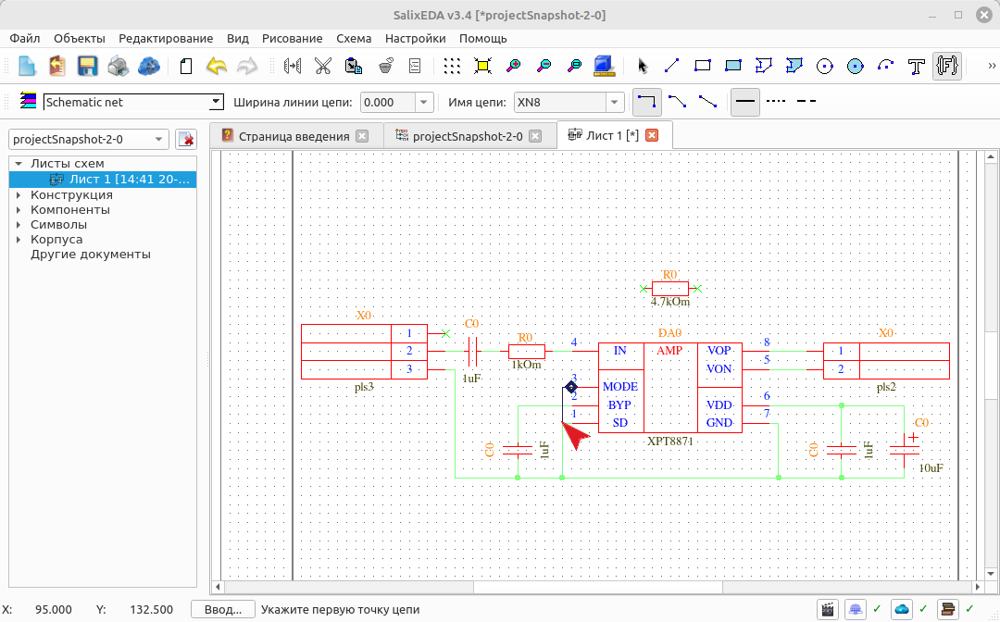

Нажмите среднюю кнопку мыши, чтобы согласиться с "разумным режимом". При этом вводится
предложенная цепь. Переместите мышь, чтобы разумный режим предложил следующую цепь.
Здесь "разумный режим" снова не в состоянии проложить правильную цепь сразу.

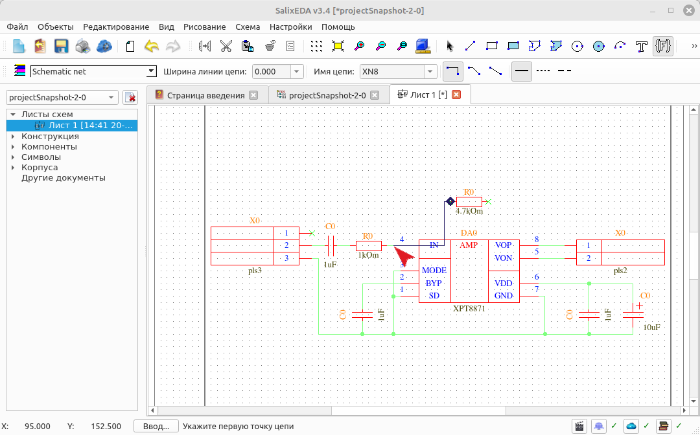

Наведите
мышь на середину цепи и нажмите левую
кнопку мыши, чтобы начать ввод ломаной цепи. Переместите мышь до следующего излома.
Нажмите левую кнопку мыши, чтобы зафиксировать излом. Перемещайте мышь в направлении
завершающего вывода цепи и разумный режим предложит завершение цепи.

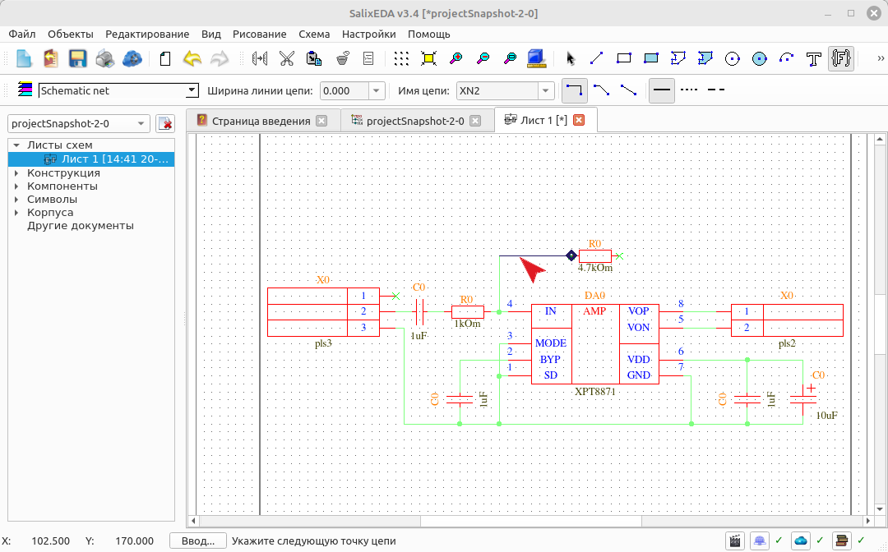

Нажмите среднюю кнопку мыши, чтобы согласиться с "разумным режимом". При этом вводится
предложенная цепь. Переместите мышь, чтобы разумный режим предложил следующую цепь.

Нажмите среднюю кнопку мыши, чтобы согласиться с "разумным режимом". При этом вводится
предложенная цепь. Переместите мышь, чтобы разумный режим предложил следующую цепь.

Следующую цепь разумный режим не может провести полностью. Нажмите левой кнопкой мыши
на горизонтальный сегмент цепи, чтобы указать точку начала цепи.

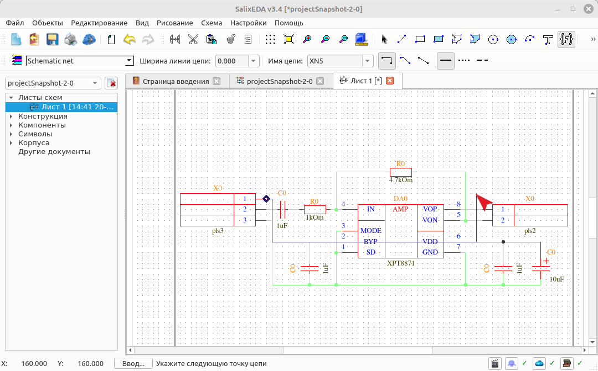

Проведите первый цепи и левой кнопкой мыши укажите точку излома.

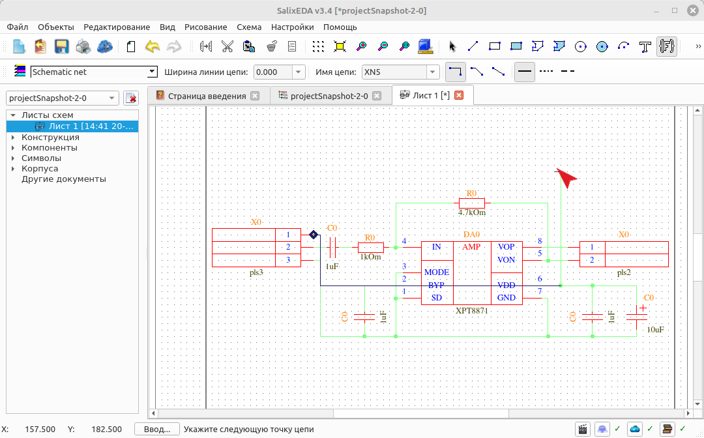

Переместите мышь, чтобы разумный режим предложил завершение цепи.

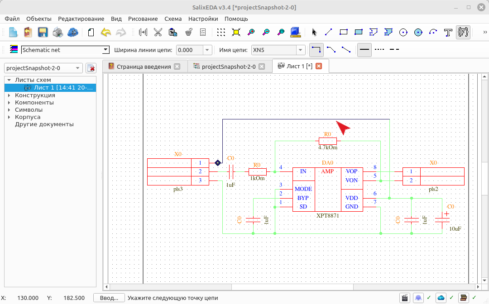

Нажмите среднюю кнопку мыши, чтобы согласиться с "разумным режимом". При этом вводится
предложенная цепь.

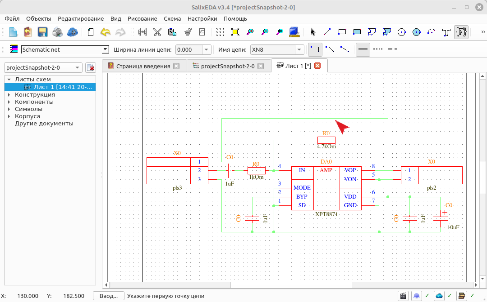

## Завершение режима ввода цепей
На этом ввод цепей закончен. Нажмите правую кнопку мыши, чтобы  прекратить режим ввода
цепей и вернуться в режим редактирования.

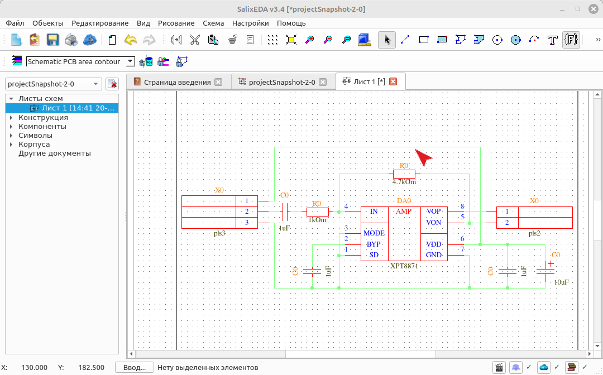

## Результат ввода цепей

