<!--Prev intro--> <!--Next insertComp-->
<!--Zoomed true-->

# Creating a new project and schematic within it
## Create a new project
Click on the button shown in the figure.

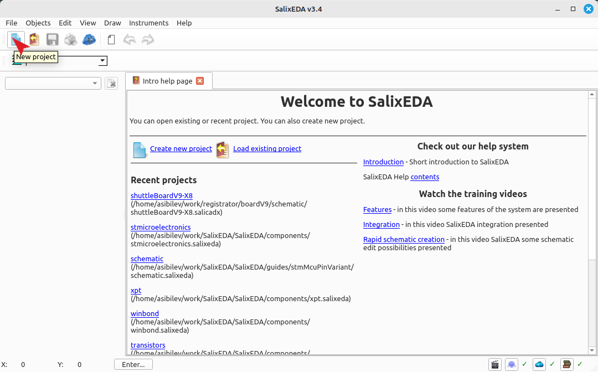

## Create a new schematic sheet
To create a new schematic sheet, click on this button.

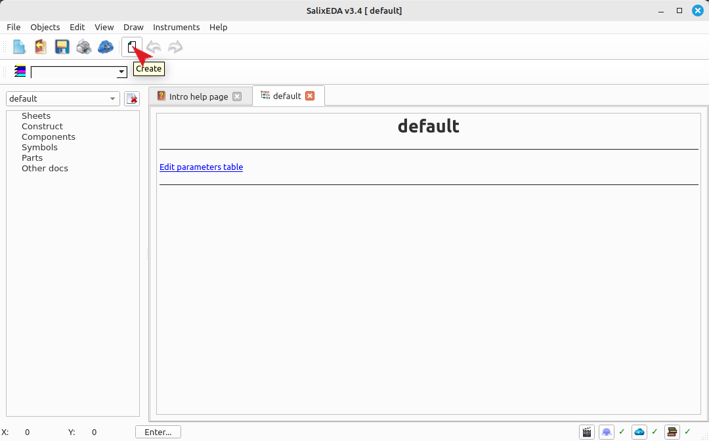

## Select the type of object to be created
A dialog box for creating a new project object will appear. In the object type list of this dialog, select "Schematic".

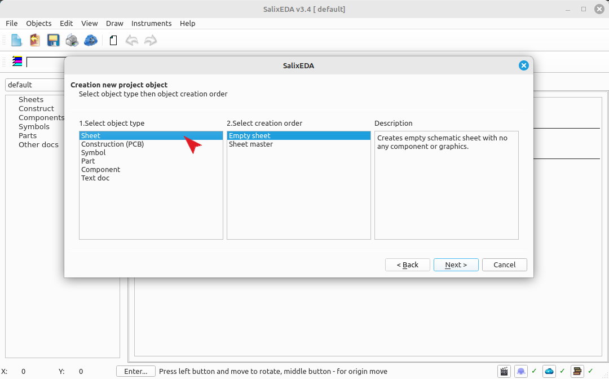

## Select the method for creating the schematic
In the object creation method, select "Schematic Wizard".

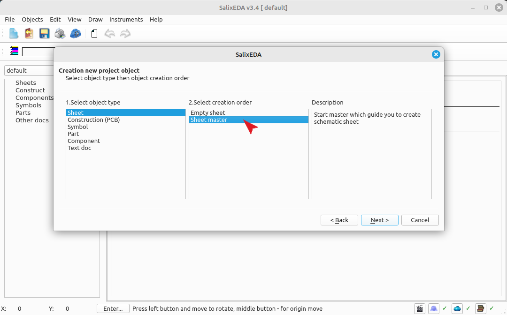

Click Next to proceed to the schematic wizard selection.

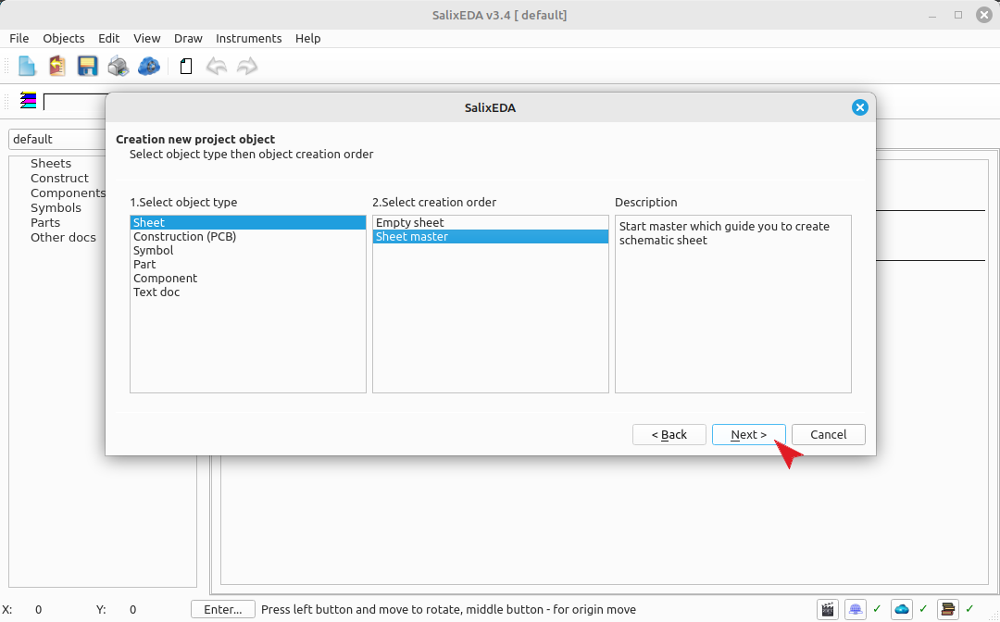

## Select the schematic creation wizard
A dialog for selecting the schematic creation wizard will appear. In it, select the "Schematic
Formatting" wizard.

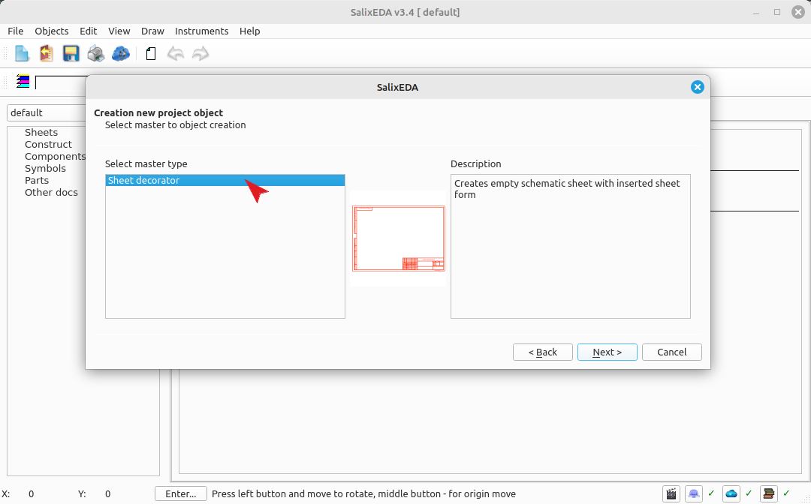

Click Next to proceed to the formatting selection.

## Select the schematic formatting collection
A list of formatting collections available in the library will appear. In the list of found formatting collections, select "form iso".

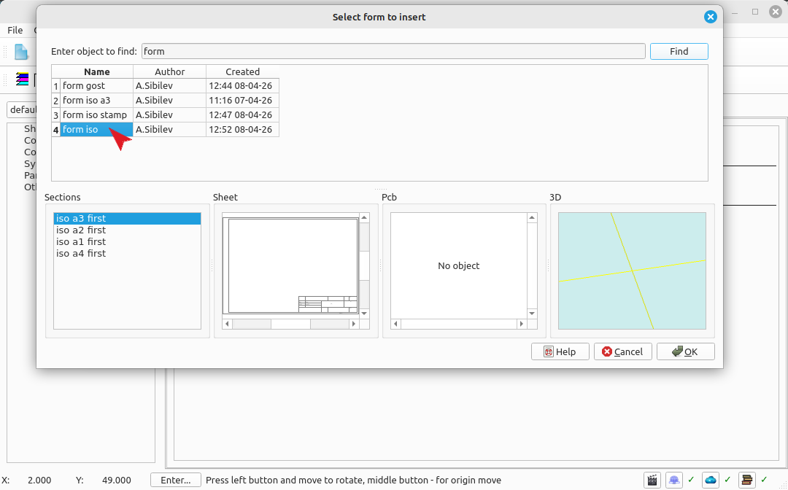

## Select the schematic formatting option
In the sections list, select the "iso a4" option as the formatting basis.

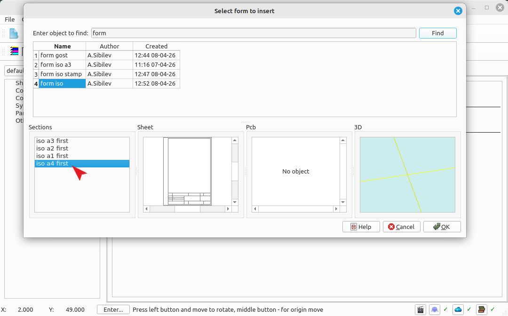

Click OK to insert the formatting into the schematic.

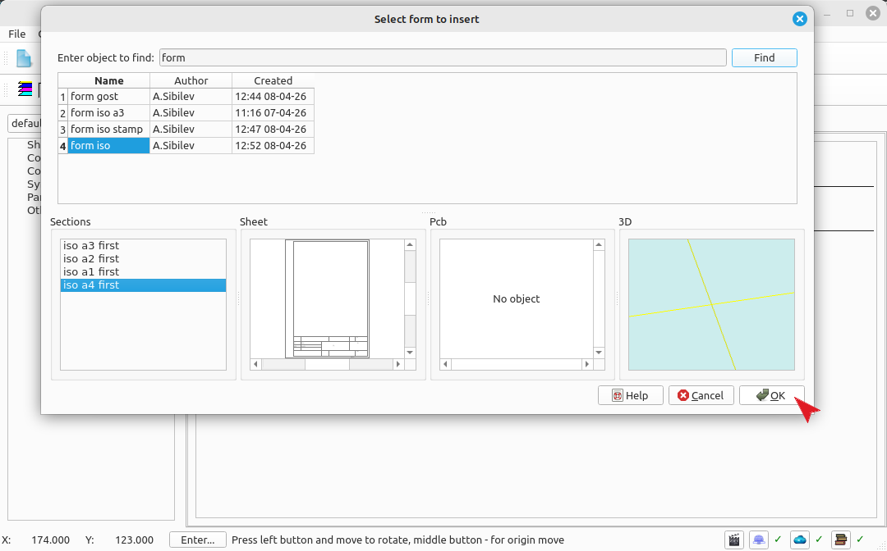

## Enter the schematic name
A window for entering the schematic name will appear. Leave the default name or enter
your own. To create the schematic, click the "Finish" button.

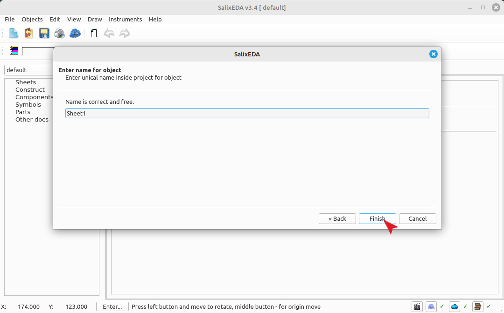

## Result
The resulting project with the schematic sheet

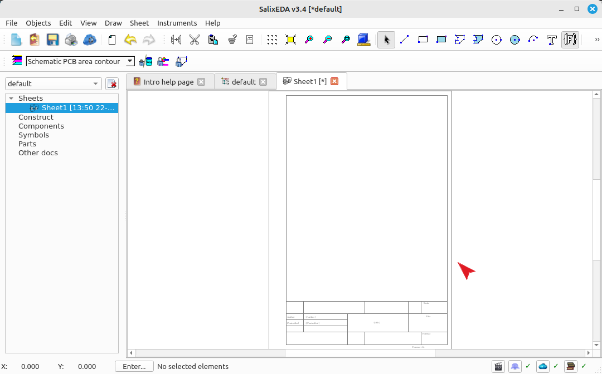
