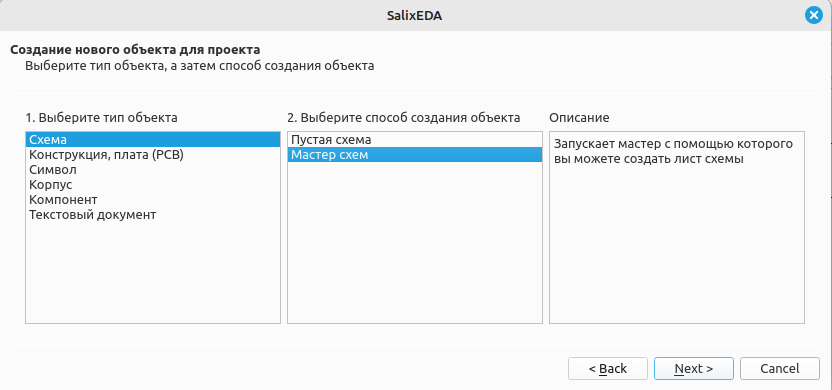
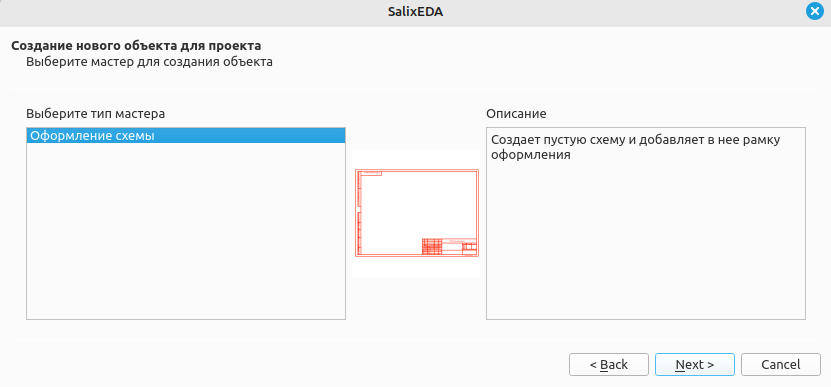
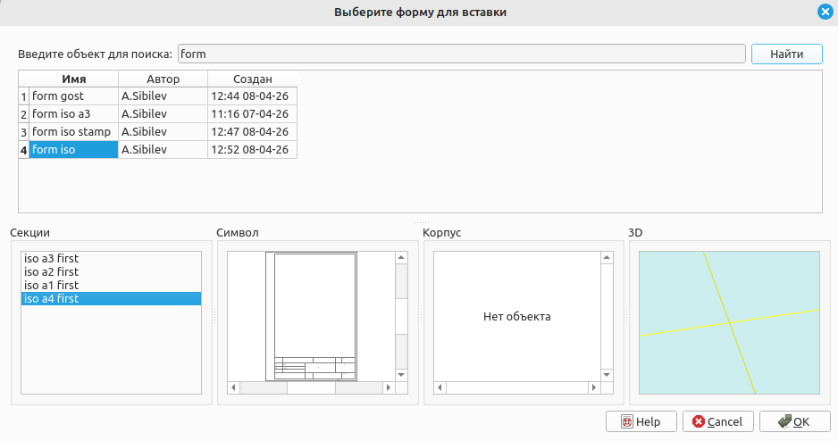
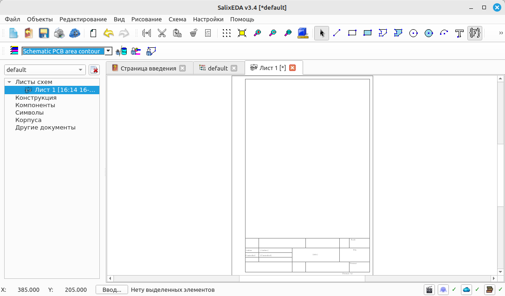

<!--Prev intro--> <!--Next insertComp-->

# Создание нового проекта и схемы в нем
Чтобы создать новый проект нажмите на кнопку  или выберите
пункт меню Файл|Новый проект.

Чтобы создать новый лист схемы нажмите на кнопку  или выберите
пункт меню Объекты|Создать...

При этом появится диалоговое окно создания нового объекта проекта.

В списке типов объекта этого диалога выберите "Схема".

В способе создания объекта выберите "Мастер схем" и нажмите Далее.

При этом появится диалог выбора мастера создания схем.

В списке типов мастеров выберите "Оформление схемы" и нажмите Далее.

При этом появится список наборов форм доступных в библиотеке.

Из списка найденных объектов-коллекций форм выберите "from iso", в списке секций выберите
"iso a4". Выбранная форма доступна для предварительного просмотра в окне Символ. Нажмите
ОК для вставки формы в схему.

При этом появляется окно для ввода имени схемы. Оставьте имя по умолчанию или введите
свое. Для создания схемы нажмите кнопку "Завершить".

Должна создаться такая схема:

