<!--Prev intro--> <!--Next insertComp-->
<!--Zoomed true-->

# Создание нового проекта и схемы в нем
## Создайте новый проект
Нажмите на кнопку, показанную на рисунке.

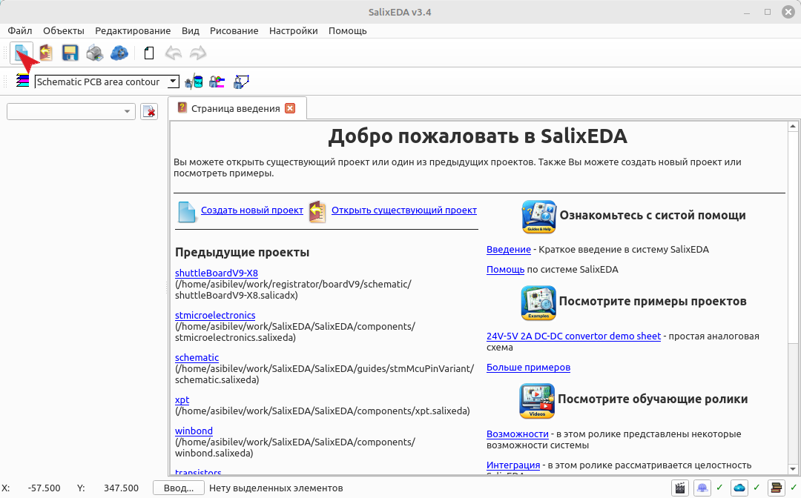

## Создайте новый лист схемы
Чтобы создать новый лист схемы нажмите на эту кнопку.

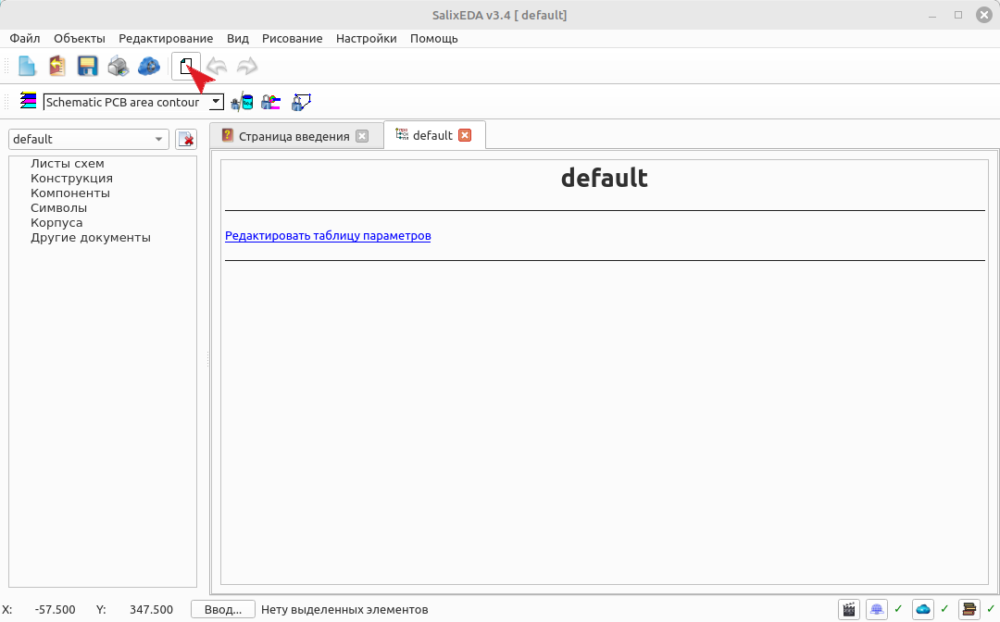

## Выбор типа создаваемого объекта
При этом появится диалоговое окно создания нового объекта проекта. В списке типов объекта этого диалога выберите "Схема".

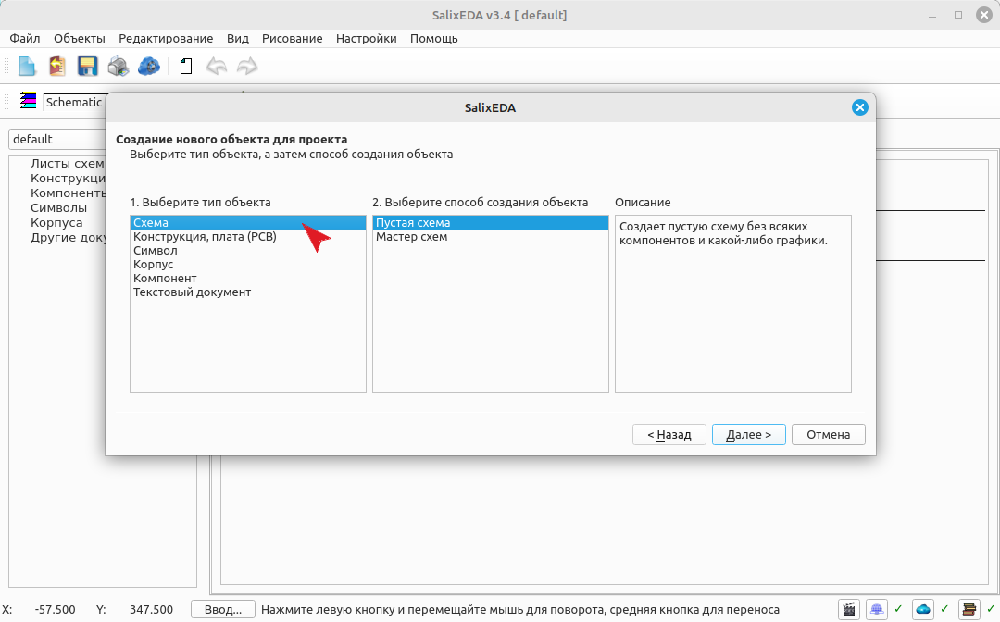

## Выбор способа создания схемы
В способе создания объекта выберите "Мастер схем".

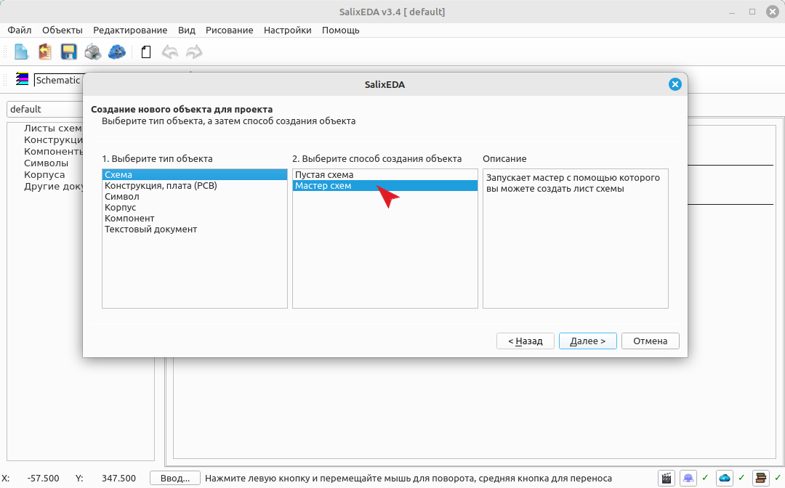

Нажмите Далее для перехода к выбору мастера схем.

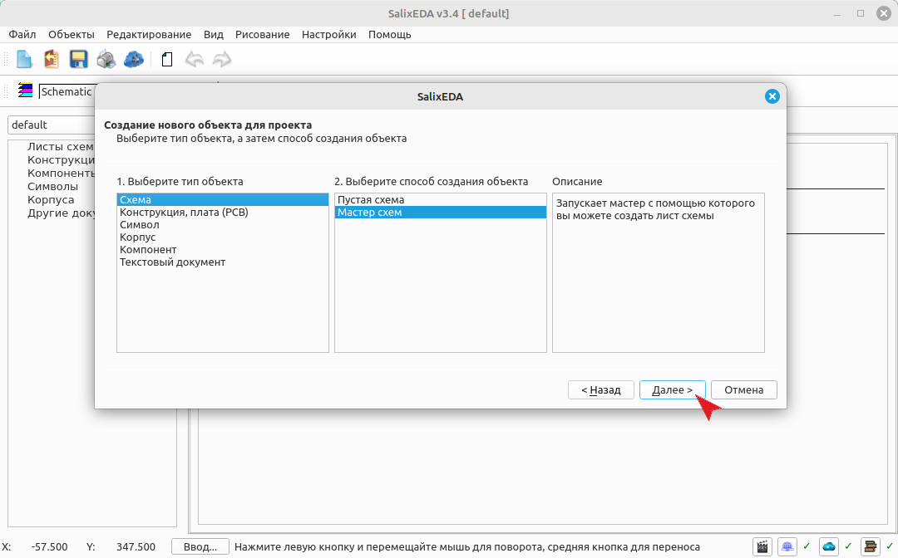

## Выбор мастера создания схем
При этом появится диалог выбора мастера создания схем. Выберите в нем мастер "Оформление
схем".

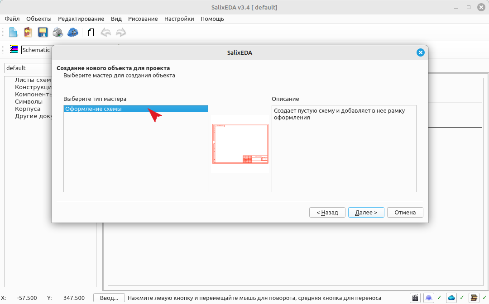

Нажмите Далее для перехода к выбору оформления.

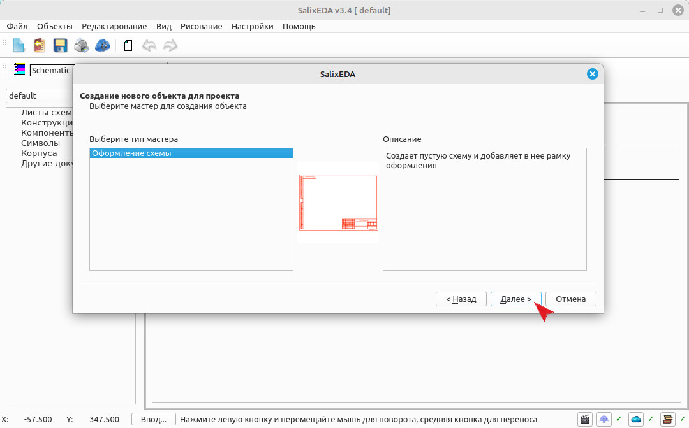

## Выбор коллекции оформления схем
При этом появится список коллекций оформлений доступных в библиотеке. В списке найденных коллекций оформления выберите "form iso".

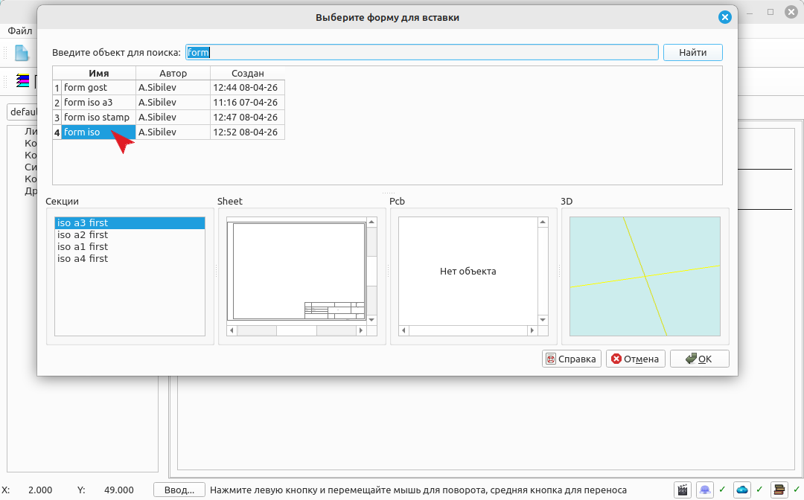

## Выбор варианта оформления схемы
В списке секций выберите вариант "iso a4" как основу оформления.

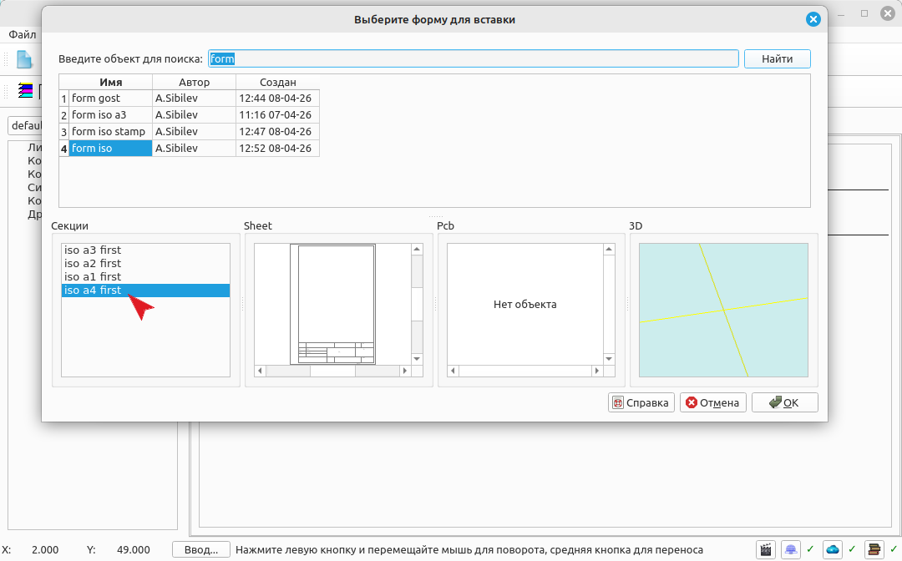

Нажмите ОК для вставки оформления в схему.

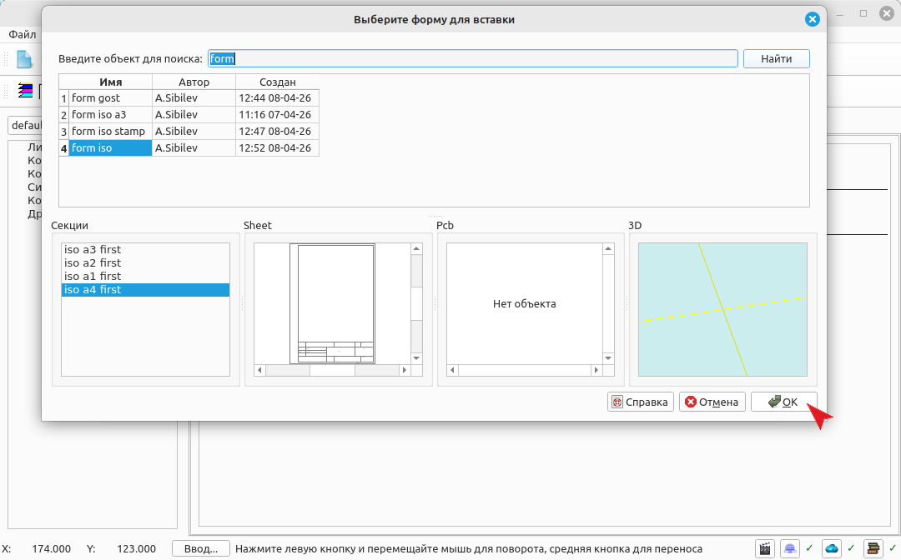

## Ввод имени схемы
При этом появляется окно для ввода имени схемы. Оставьте имя по умолчанию или введите
свое. Для создания схемы нажмите кнопку "Завершить".

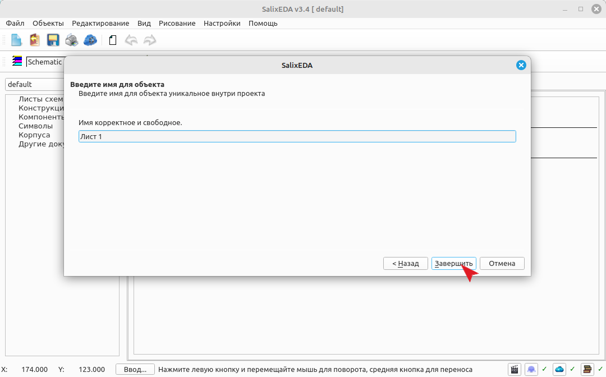

## Результат
Результирующий проект с листом схемы

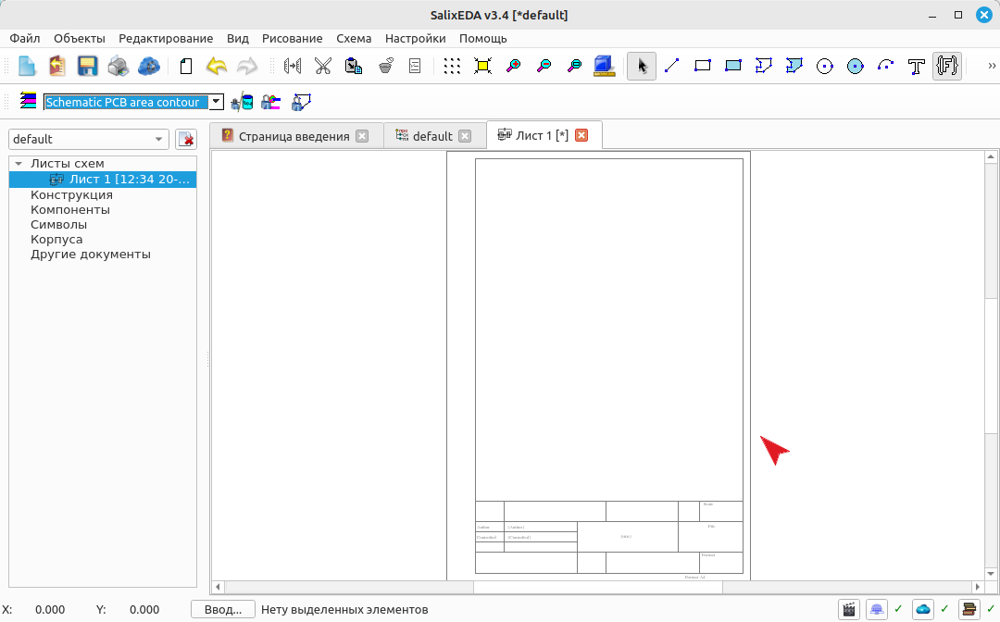
