<!--Prev wireTrace--> <!--Next production-->
<!--Zoomed true-->
# Adding a polygon
## Enabling polygon input mode
To add a polygon, click this button.

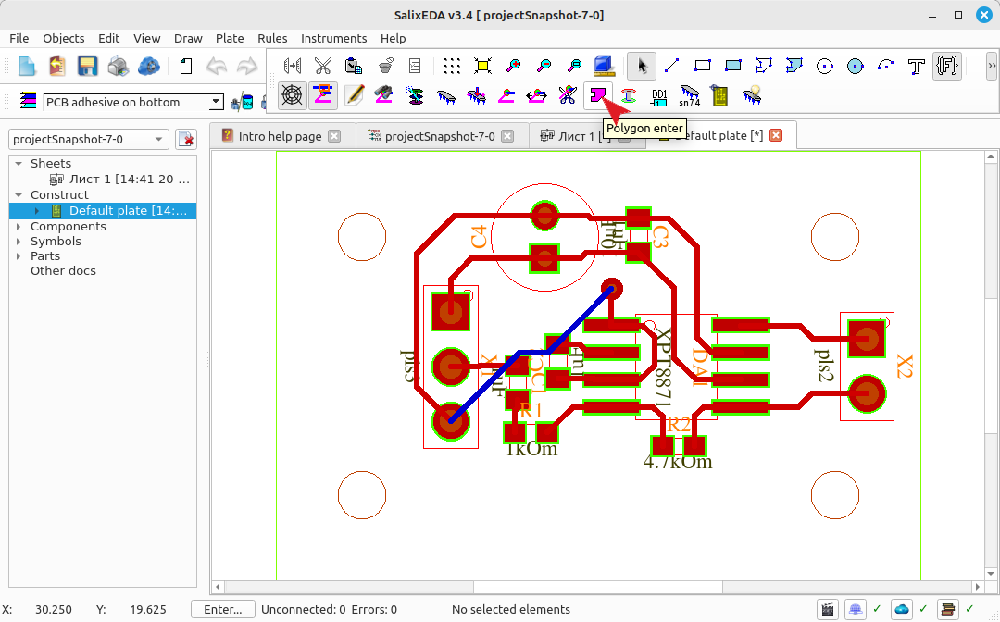

## Changing the polygon grid
By default, polygon vertices align to the grid. Let's set a finer grid.
To do this, click this button.

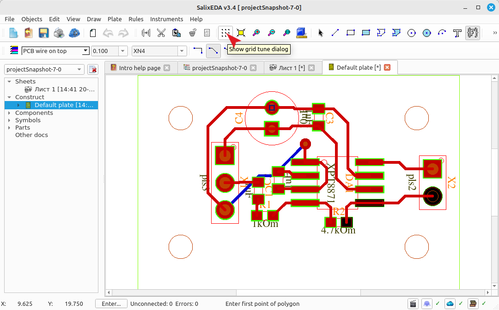

In the Grid step field, enter 0.625 or select 0.625x0.625 from the list of previous grids.

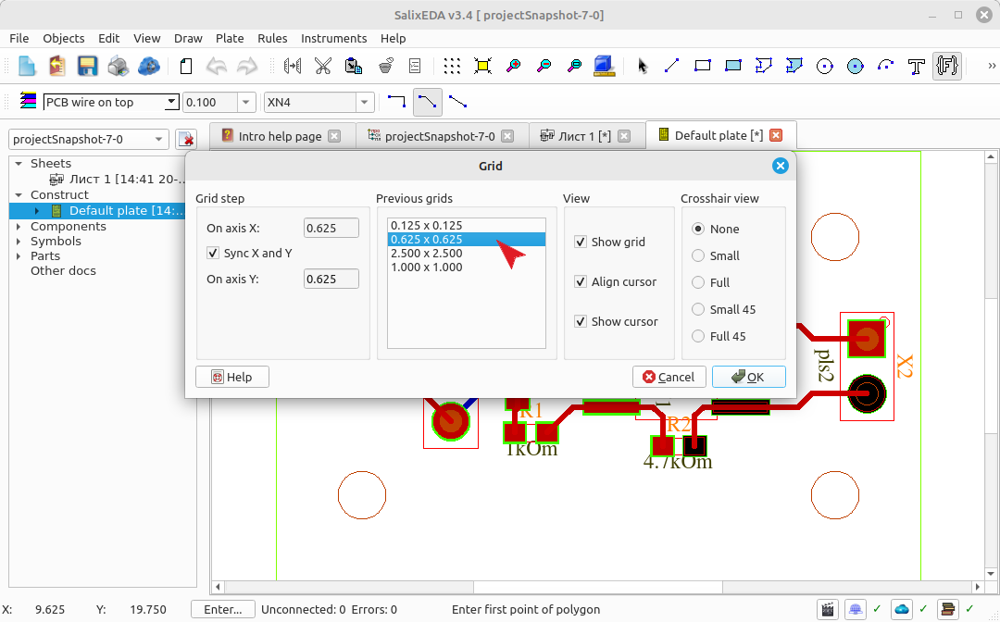

Click OK to finish.

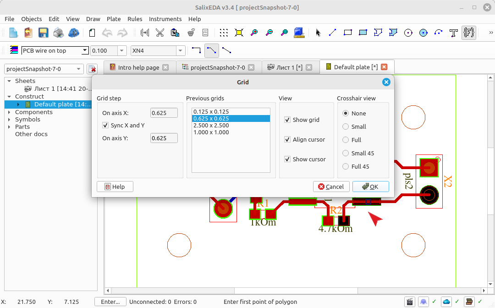

## Setting the clearance
Enter 0.5 in this field. This is the clearance between the polygon and the traces and pads inside the polygon.

## Selecting the polygon net
Click this button to open the list of available nets for the polygon.

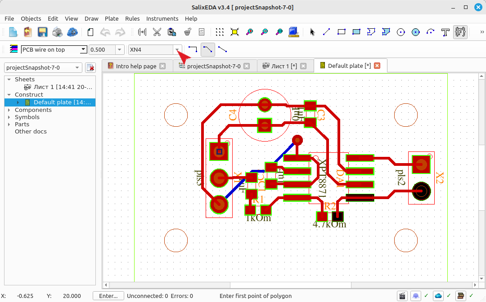

Select GND from the list.

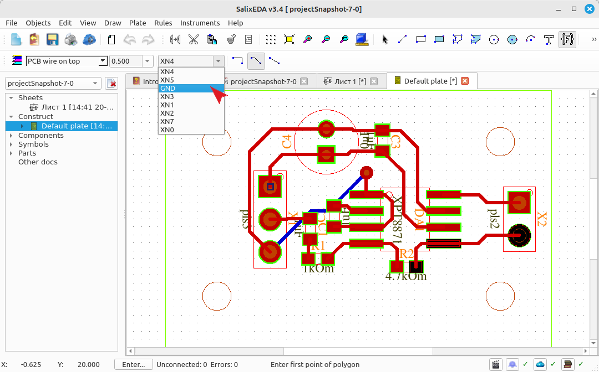

Pads belonging to this net on all layers are highlighted.

Click this button to change the vertex angle of the polygon outline lines.

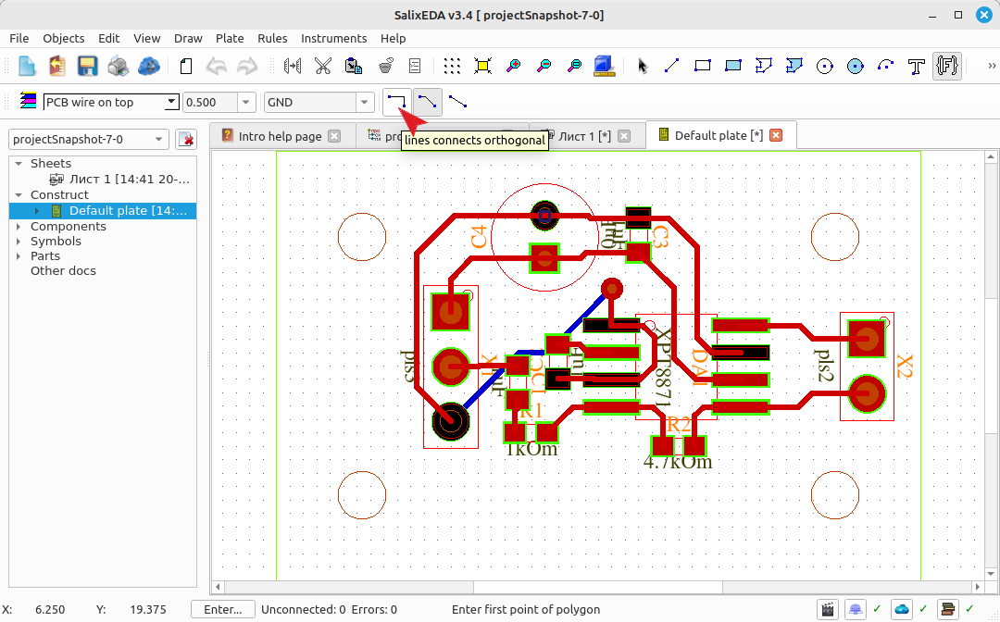

## Selecting the polygon layer
Click this button to select the layer for the polygon.

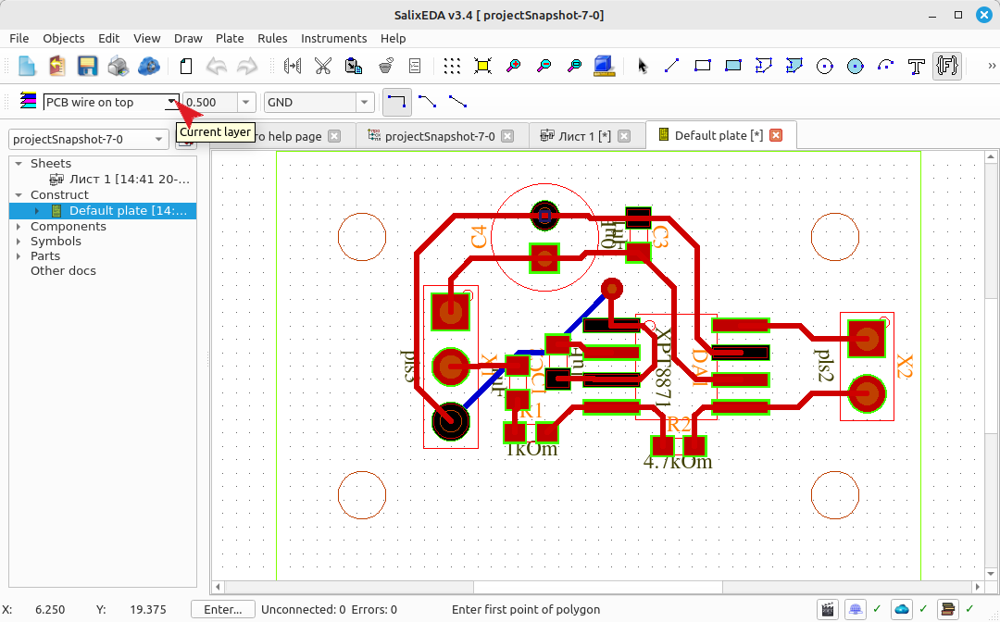

Select bottom from the list.

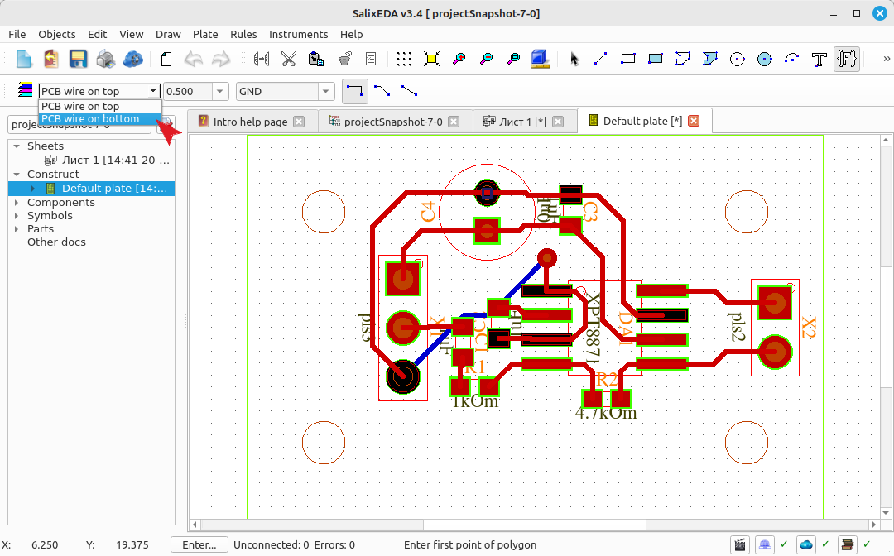

## Entering the polygon outline
Press the left button to start entering the polygon outline.

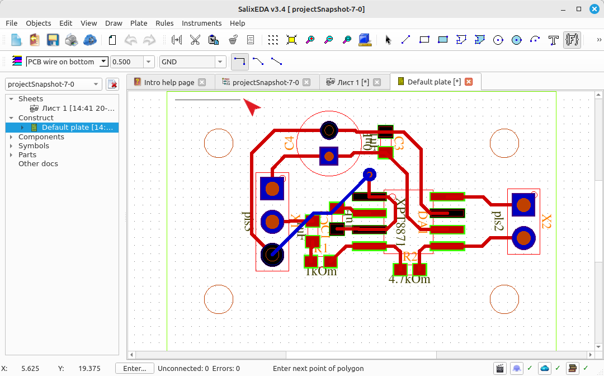

Move the mouse to the next vertex and press the left mouse button.

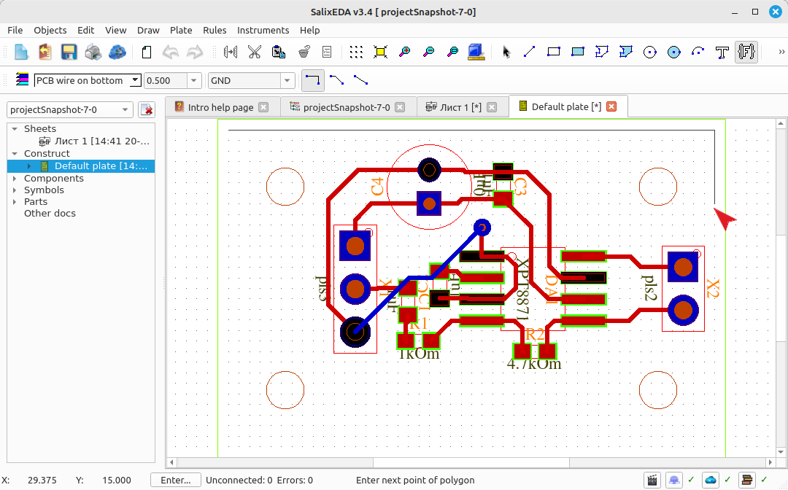

Move the mouse to the next vertex and press the left mouse button.

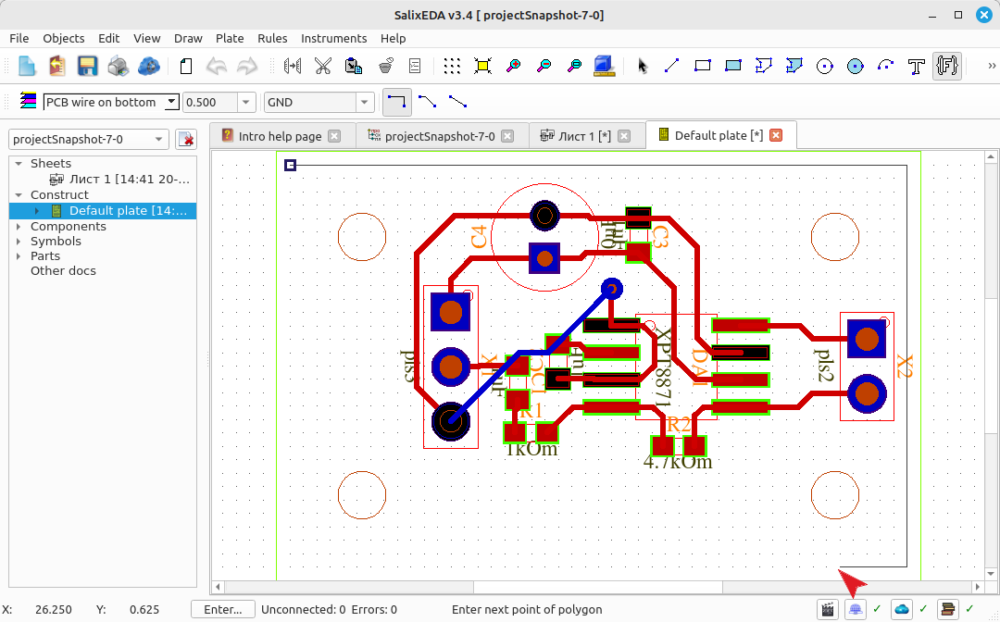

Move the mouse to the next vertex and press the left mouse button.

Press the middle mouse button to close the polygon region.

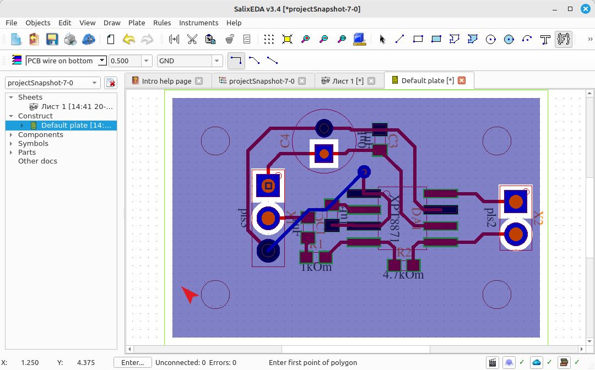

## Exiting polygon input mode
Press the right mouse button to finish adding the polygon.

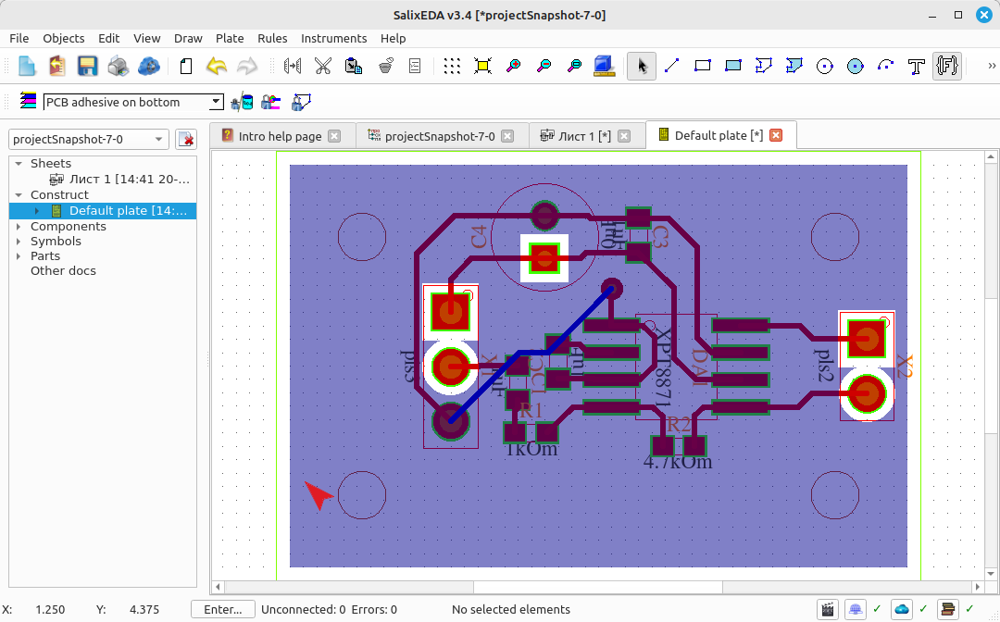

