<!--Prev wireTrace--> <!--Next production-->
<!--Zoomed true-->
# Добавление полигона
## Включение режима ввода полигона
Для добавления полигона нажмите такую кнопку.

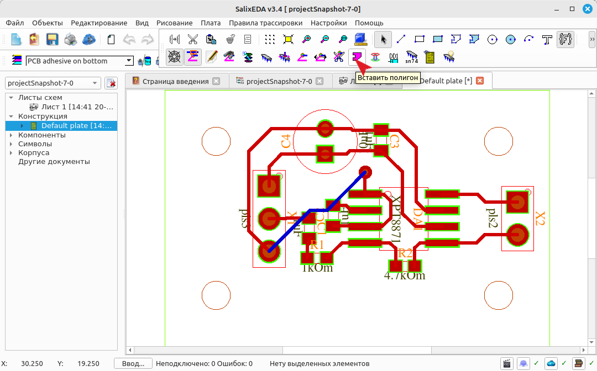

## Смена сетки для полигона
По умолчанию вершины полигона выравниваются по сетке. Установим более мелкую сетку.
Для этого нажмите на такую кнопку.

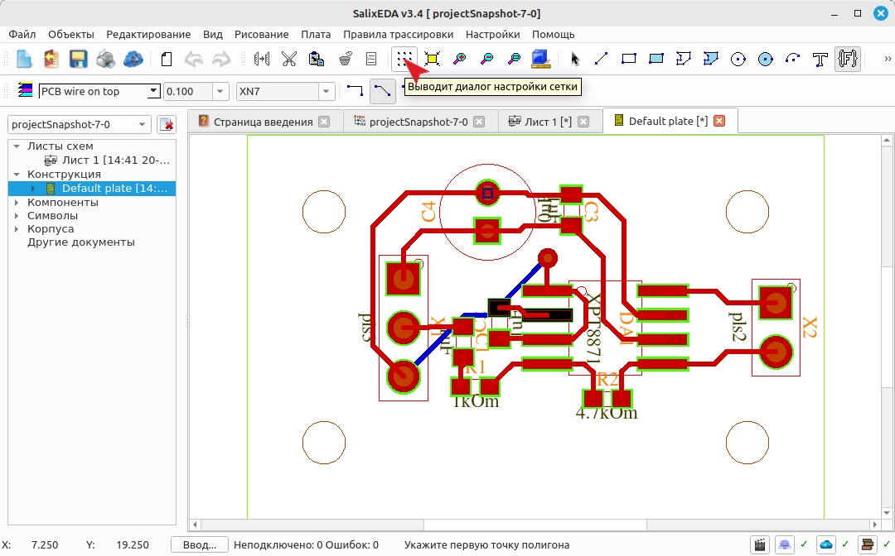

В поле Шаг сетки введите 0.625 или выберите из списка предыдущих сеток 0.625х0.625.

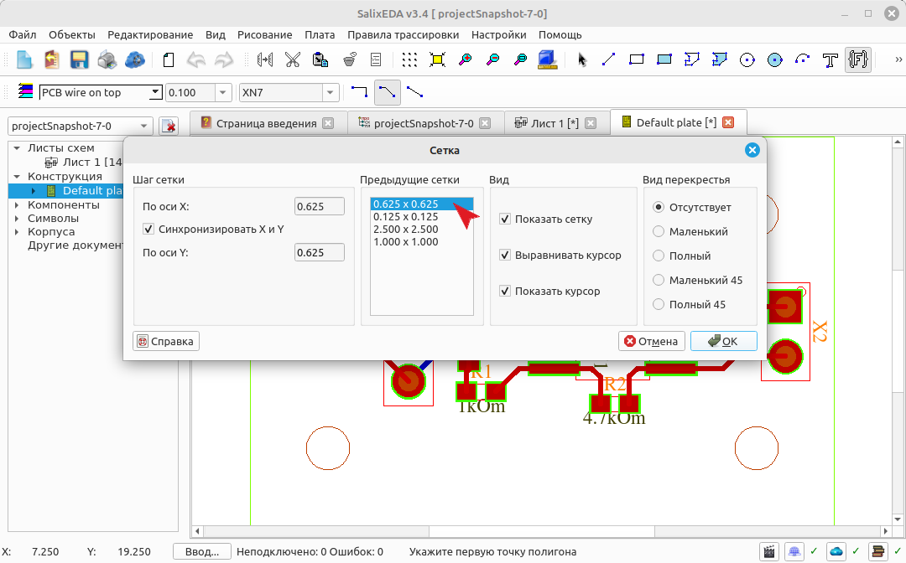

Нажмите ОК для завершения.

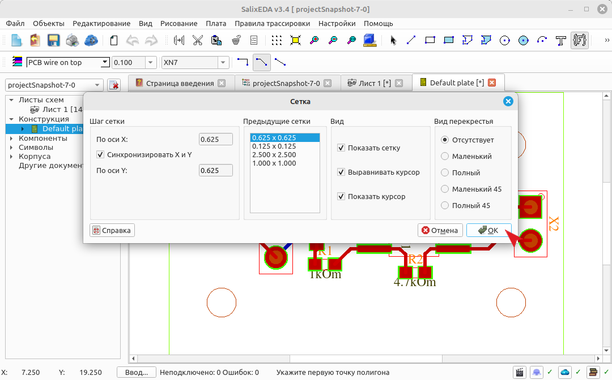

## Настройка зазора
В этом поле введите 0.5. Это зазор между полигоном и дорожками и площадками внутри полигона.

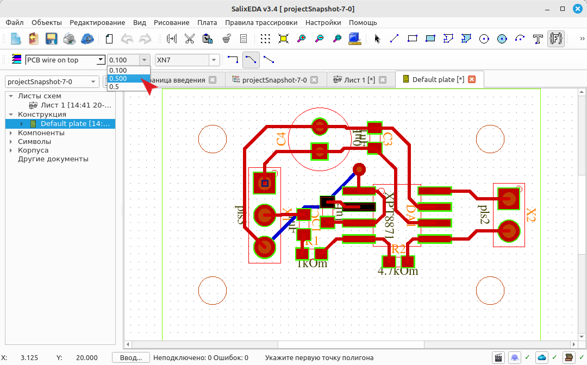

## Выбор цепи полигона
Нажмите эту кнопку, чтобы открыть список доступных цепей для полигона.

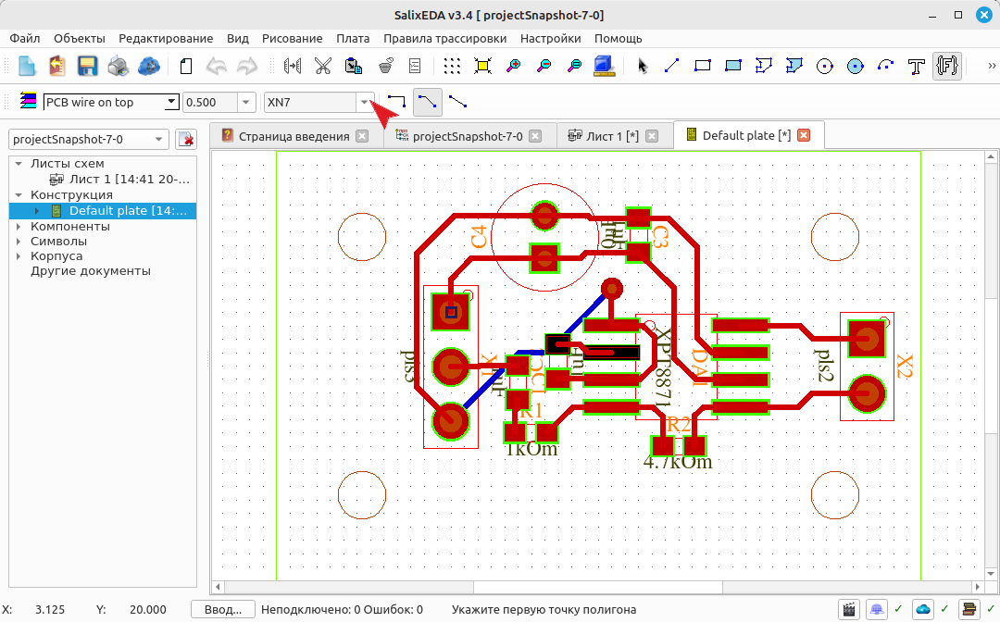

В списке выберите GND.

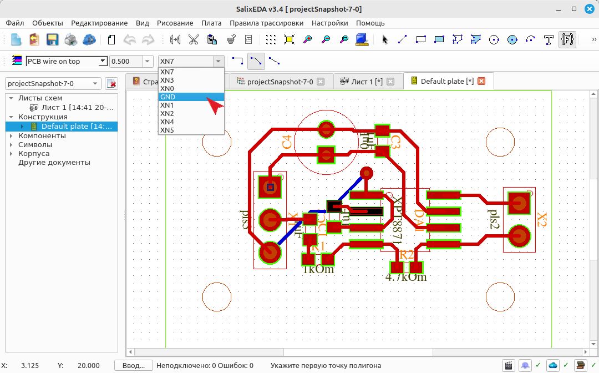

Подсвечиваются площадки, принадлежащие данной цепи на всех слоях.

Нажмите на эту кнопку, чтобы поменять угол излома линий контура полигона.

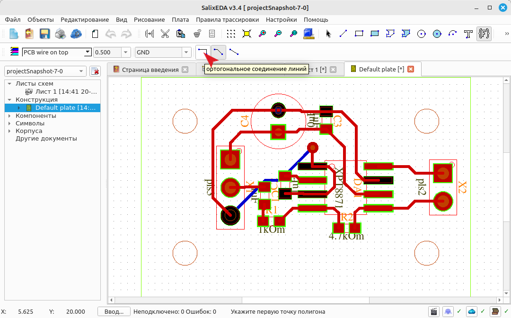

## Выбор слоя полигона
Нажмите на эту кнопку, чтобы выбрать слой для полигона.

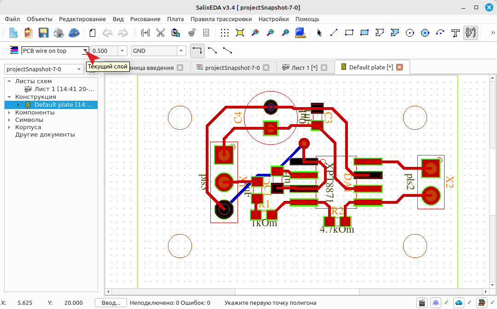

В списке выберите bottom

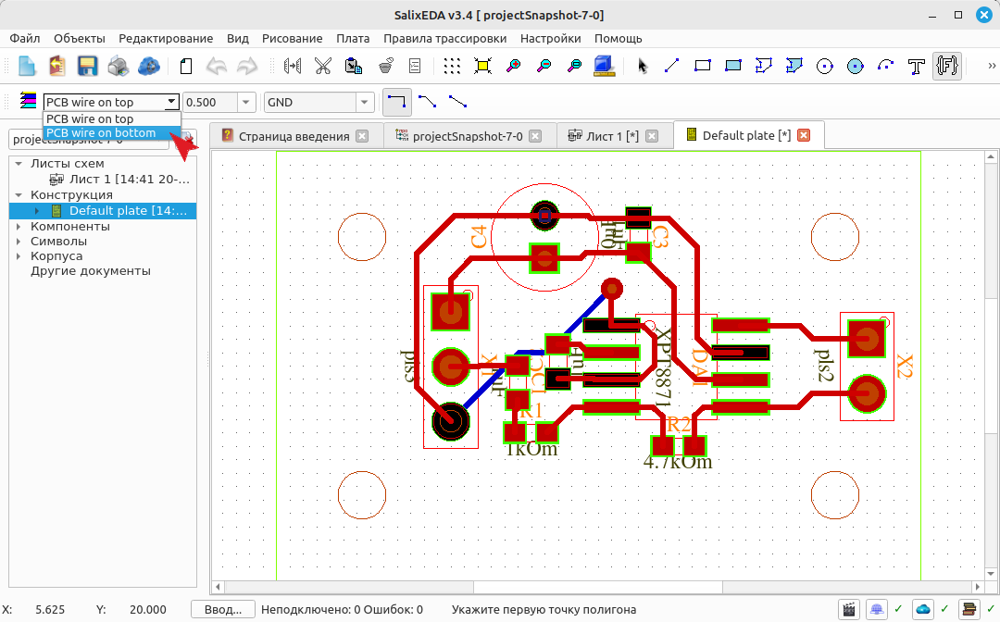

## Ввод контура полигона
Нажмите левую кнопку, чтобы начать ввод контура полигона.

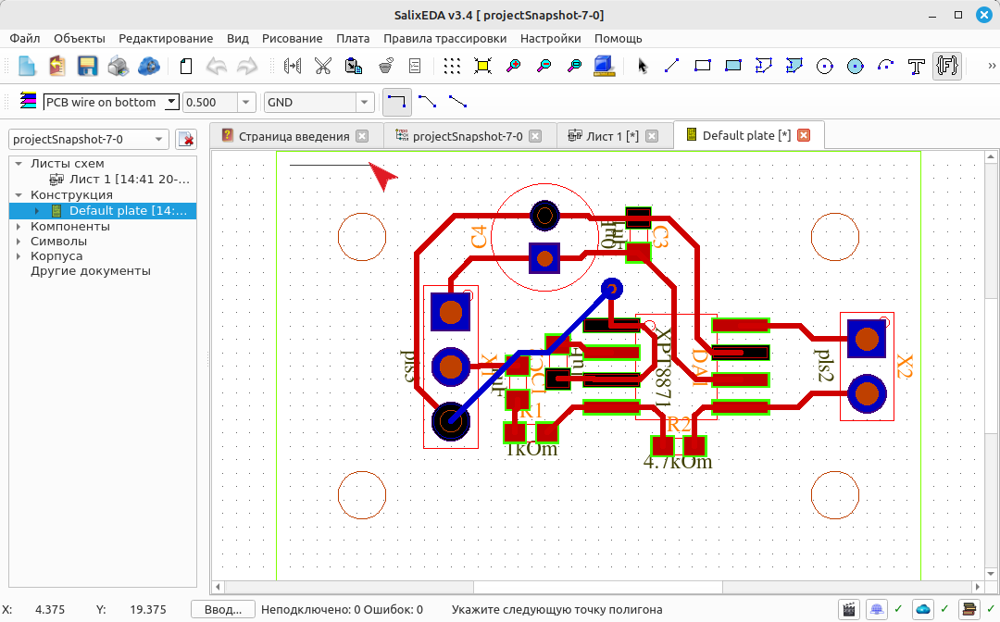

Ведите мышь до следующего излома и нажмите левую кнопку мыши.

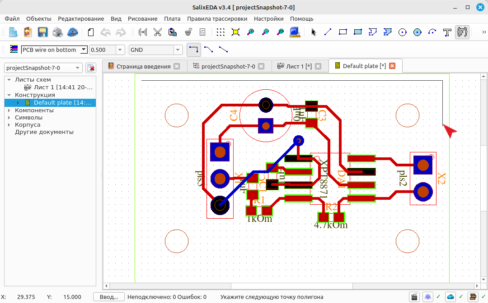

Ведите мышь до следующего излома и нажмите левую кнопку мыши.

Ведите мышь до следующего излома и нажмите левую кнопку мыши.

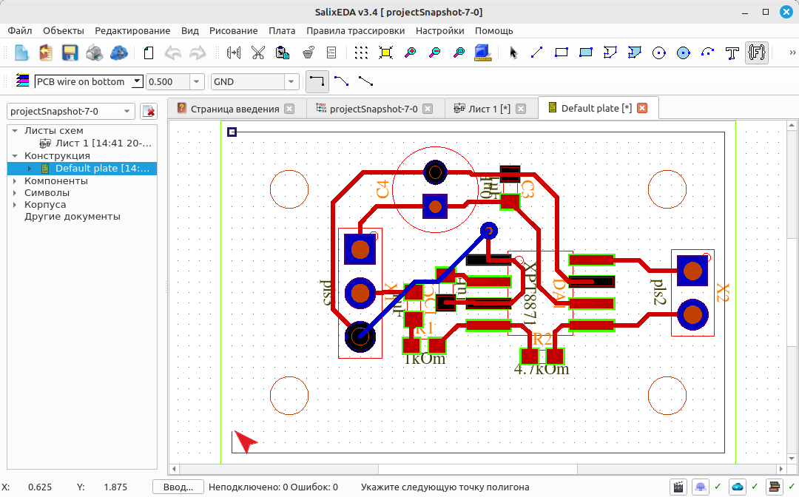

Нажмите среднюю кнопку мыши, чтобы замкнуть регион полигона.

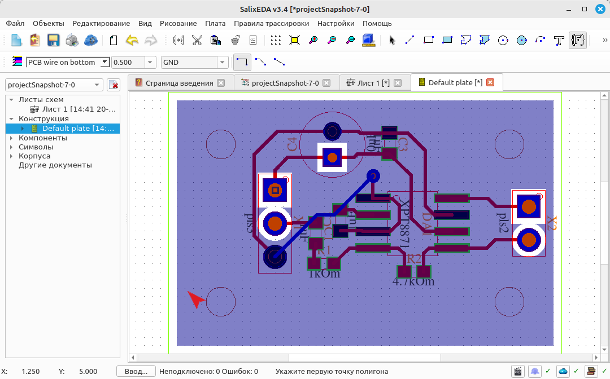

## Завершение режима ввода полигона
Нажмите правую кнопку мыши, чтобы завершить добавление полигона.

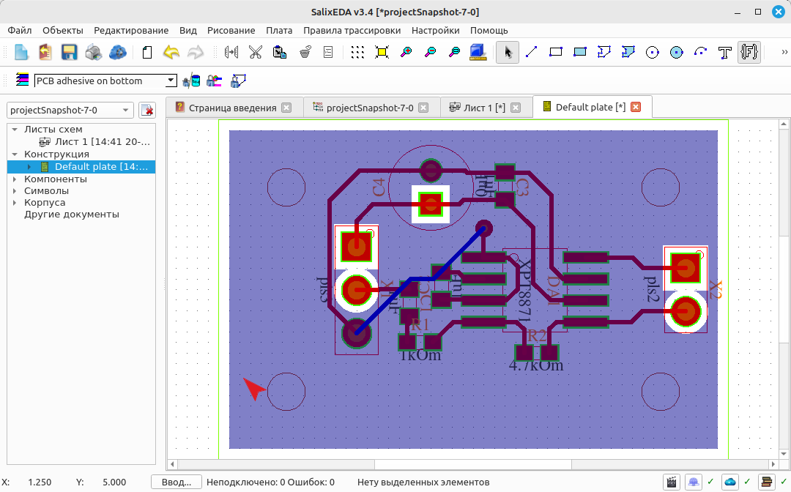

