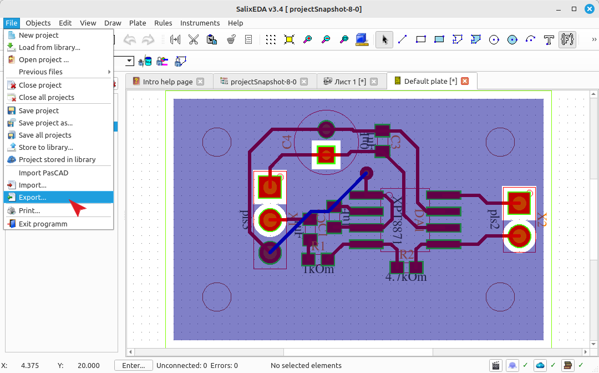
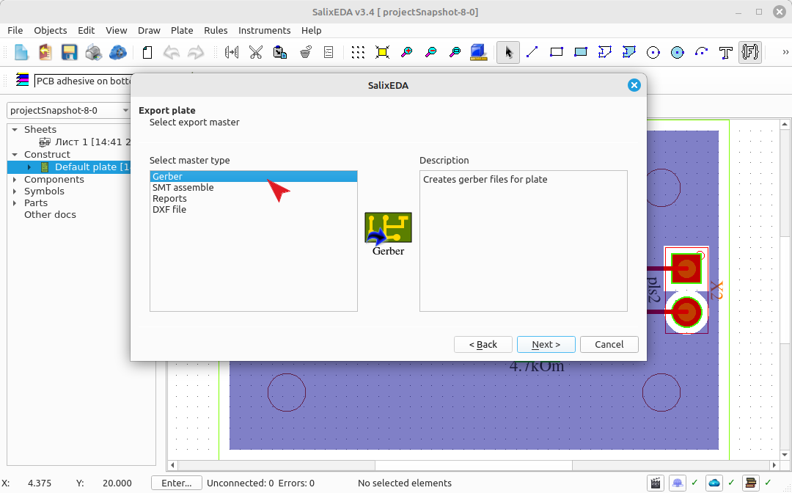
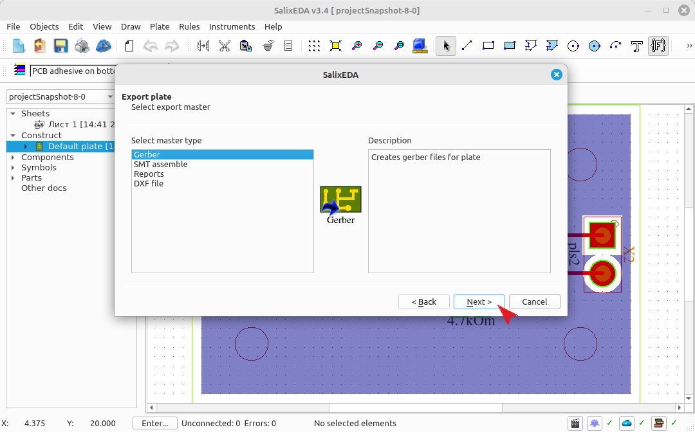
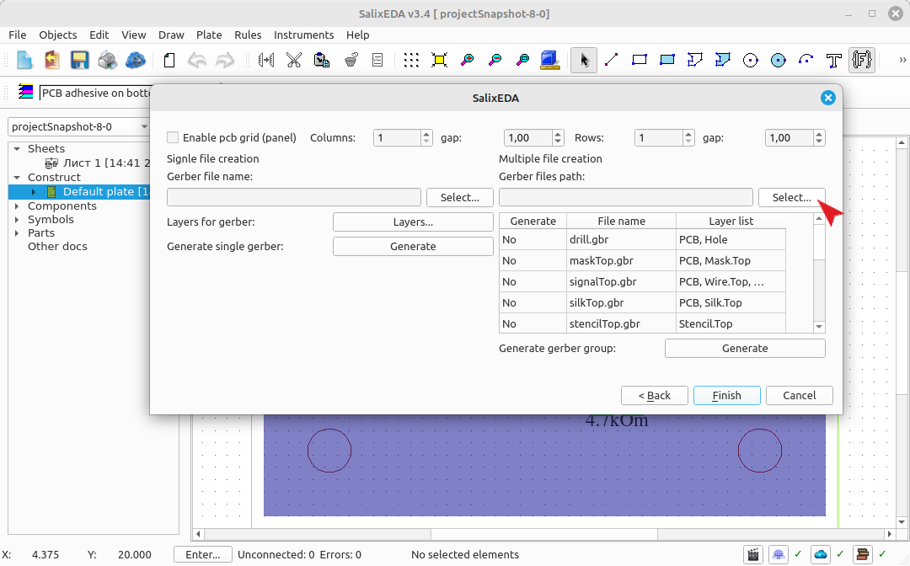
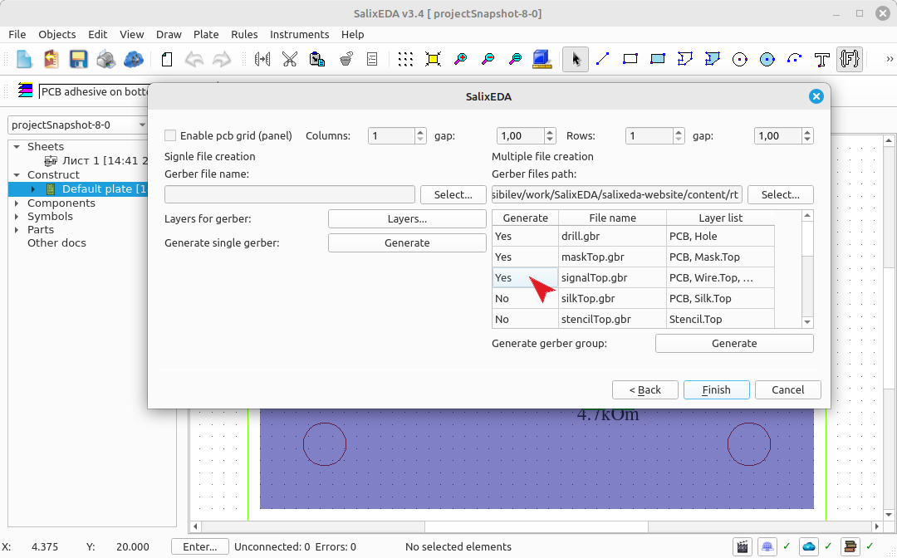
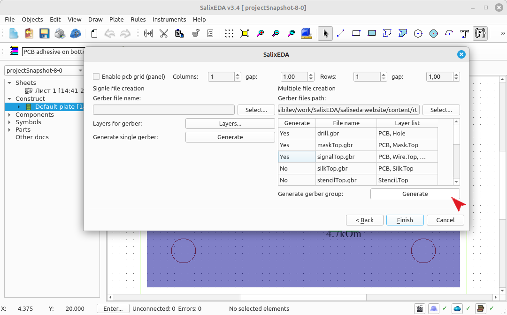
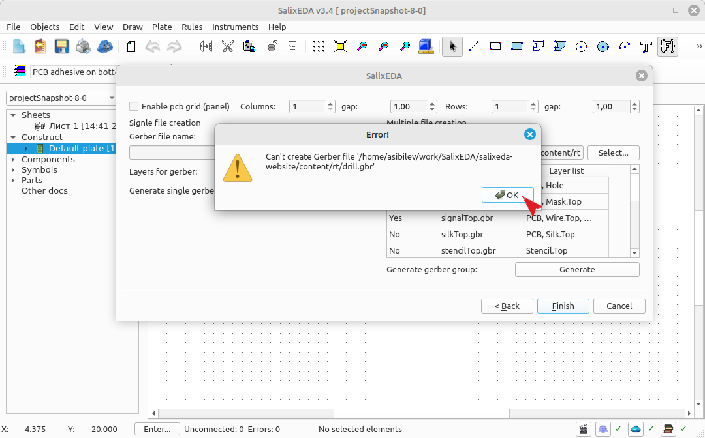
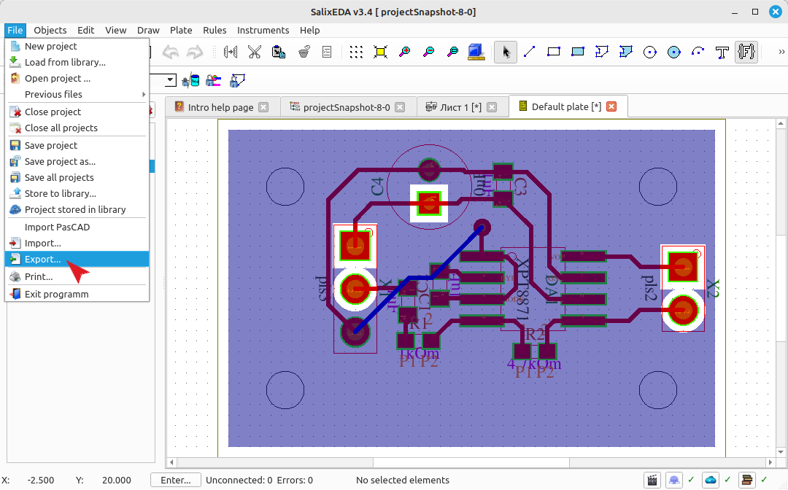
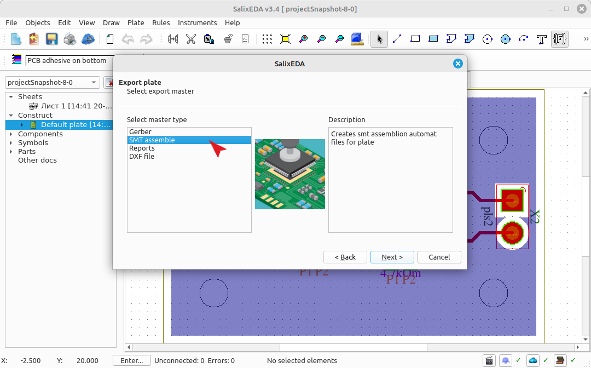
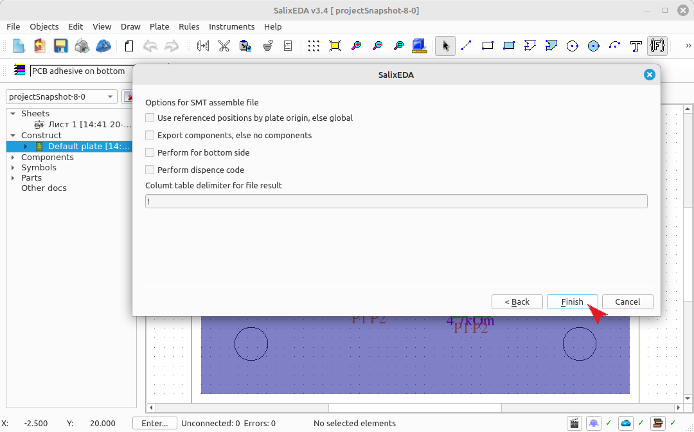

<!--Prev polygon-->
<!--Zoomed true-->
# Generating manufacturing files
## Generating Gerber files
To generate manufacturing files, select the menu item File|Export

In the "Wizard type" list, select Export to Gerber file.

Click the Next button.

Gerber files are best generated in batch mode. It's faster. Use the right
side of the dialog for this. Click this button to select the directory where the generated Gerber files will be located.

Check in the table which files you want to generate.

Click this button to start the generation process.

The system will sequentially generate the files you specified.

Click this button to finish.

## Generating files for the installer
To generate a component installer file, select the menu item File|Export

In the "Wizard type" list, select "For STM installer".

Click the Next button.

Leave all fields as default. This will generate a file for the top-side component installer. Click this button to generate the file.

