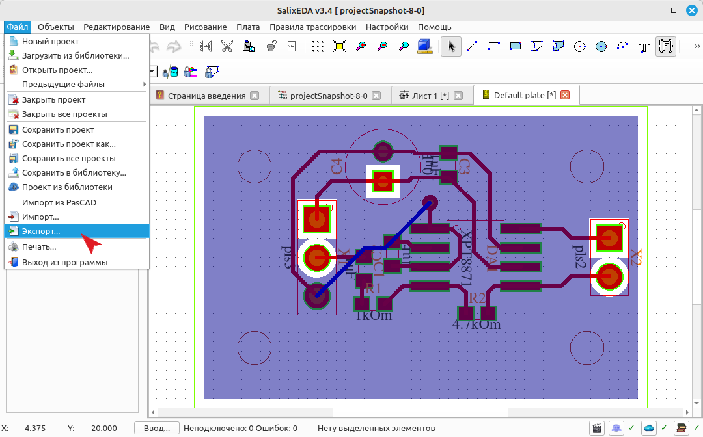
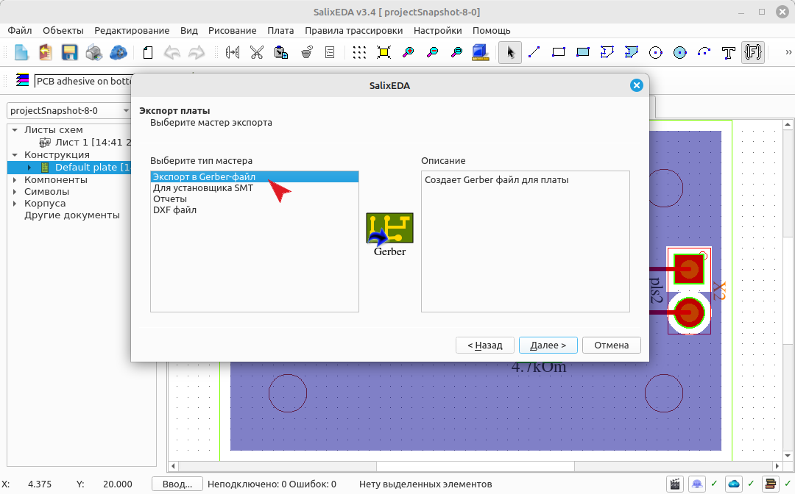
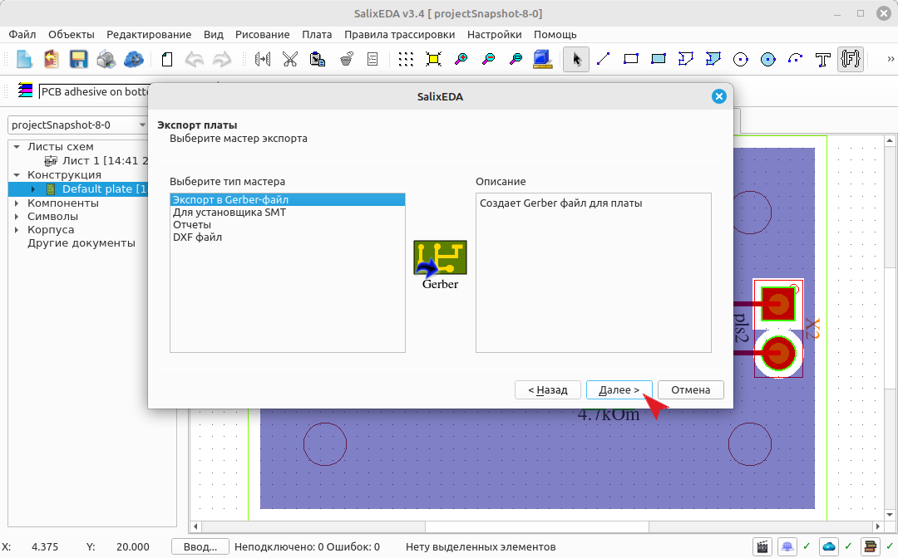
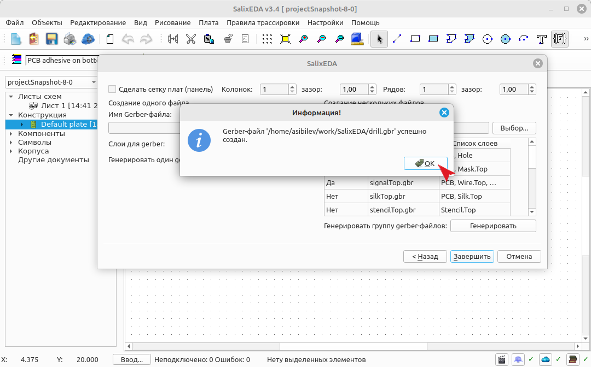
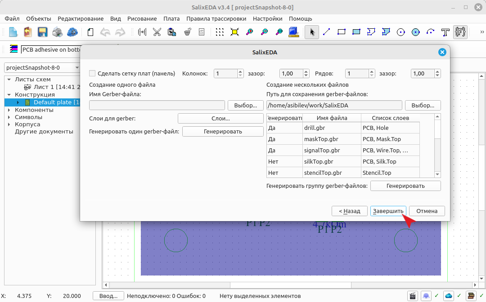
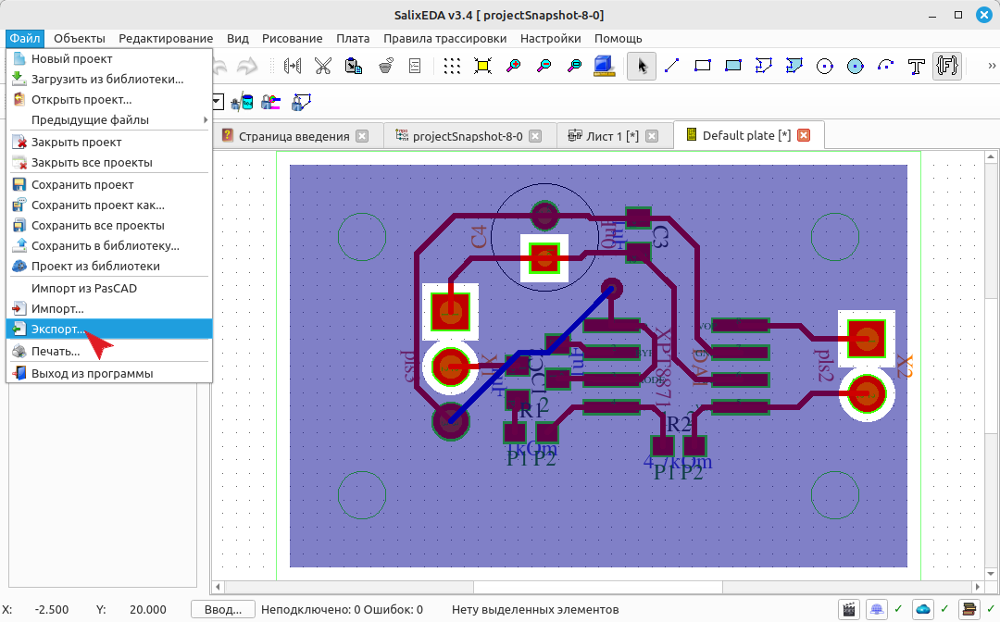
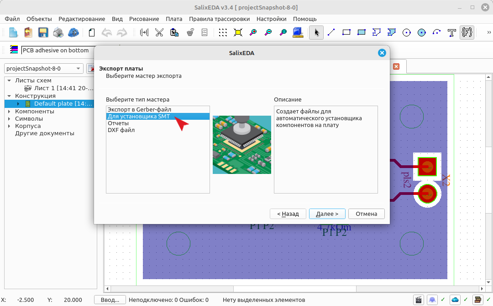
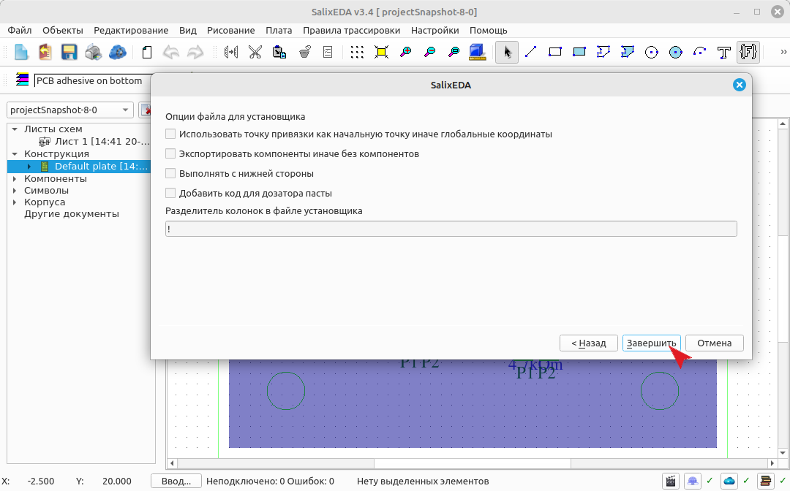

<!--Prev polygon-->
<!--Zoomed true-->
# Формирование файлов производства
## Формирование Gerber-файлов
Чтобы сформировать файлы для производства выберите пункт меню Файл|Экспорт

В списке "Тип мастера" выберите Экспорт в Gerber-файл.

Нажмите кнопку Далее.

Gerber-файлы лучше формировать пакетно. Так быстрее. Воспользуйтесь для этого правой
стороной диалога. Нажмите эту кнопку, чтобы выбрать директорий, где будут расположены
сформированные Gerber-файлы.

Отметьте в таблице какие файлы вы хотите сформировать.

Нажмите эту кнопку, чтобы запустить процесс генерации.

Система последовательно сформирует указанные вами файлы.

Для завершения нажмите эту кнопку.

## Формирование файлов для установщика
Для формирования файла установщика компонентов выберите пункт меню Файл|Экспорт

В списке "Тип мастера" выберите "Для установщика STM".

Нажмите кнопку Далее.

Оставьте все поля по умолчанию. Это приведет к формированию файла для установщика
компонентов с верхней стороны. Нажмите на эту кнопку для формирования файла.

