<!--Prev insertNet--> <!--Next createPcb-->
<!--Zoomed true-->
# Final schematic formatting

## Renumeration
To identify components, each of them contains a unique identifier
within a single PCB. SalixEDA can assign these identifiers automatically.
In the Schematic menu, select the Renumeration item.

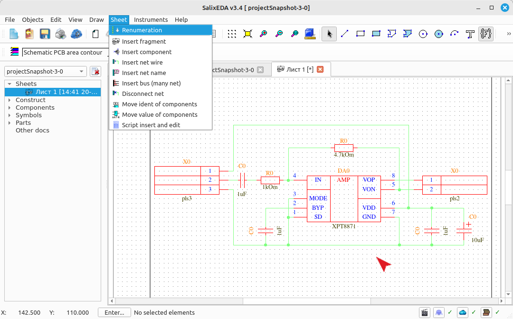

SalixEDA will assign identifiers to the components according to the rules
defined in the settings. By default, GOST rules are used: top to bottom and
left to right.

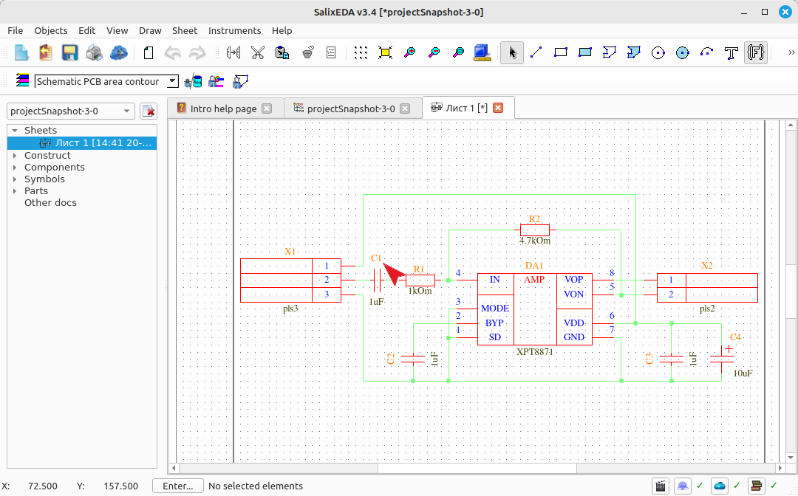

## Enabling text input mode
Often text notes need to be placed on the schematic. The text input mode serves this purpose.
To enable text input mode, click on this button.

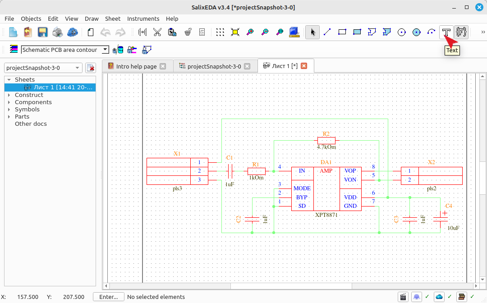

## Using text input mode
Text is a single line of characters. To enter such a line, hover the mouse
over the location where this line will be placed and press the left mouse button.
Character input will be enabled, and the input location will be marked with a vertical bar.

Type characters from the keyboard.

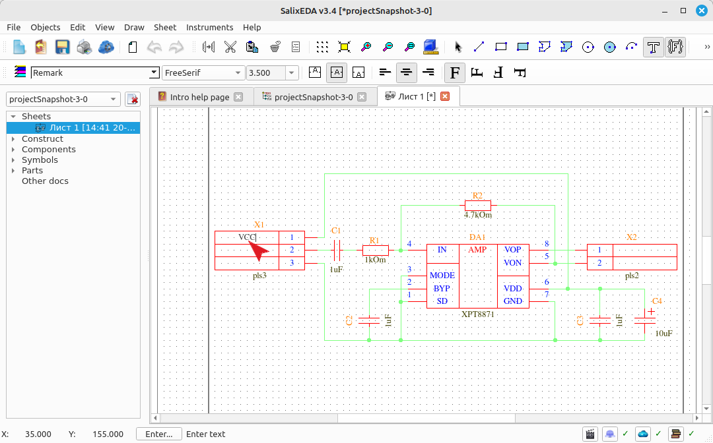

When you finish typing the line, press Enter or the left mouse button.

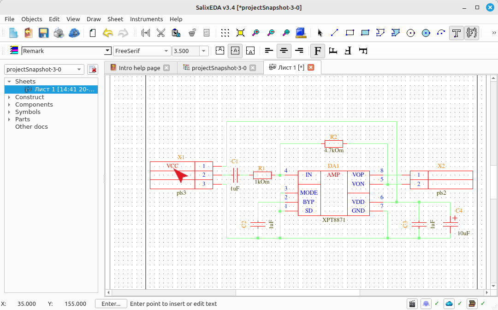

Hover the mouse over the location where the next line will be placed and press the left mouse button. Type the line characters.

Press Enter or the left mouse button to finish input.

Hover the mouse over the location where the next line will be placed and press the left mouse button. Type the line characters.

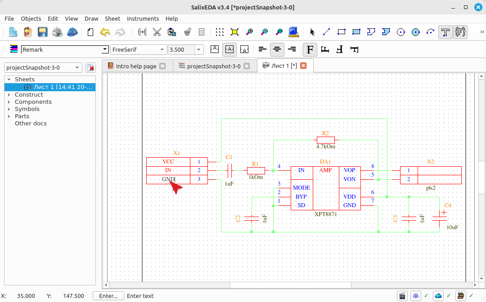

Press Enter or the left mouse button to finish input.

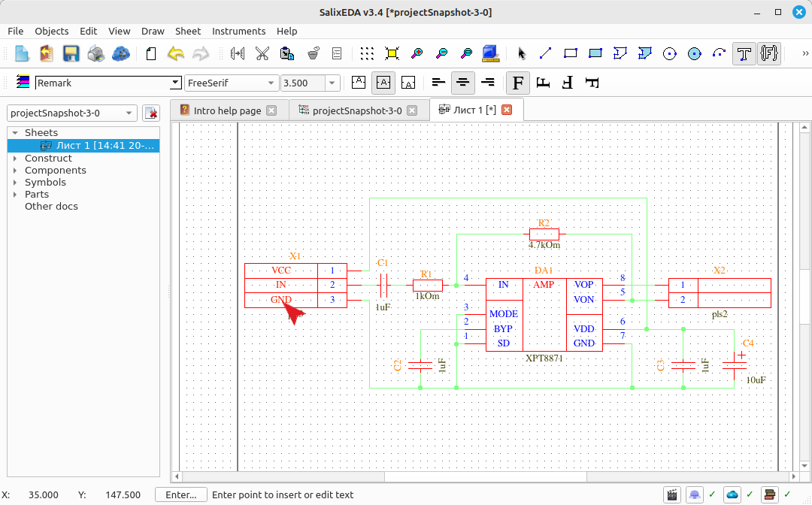

Hover the mouse over the location where the next line will be placed and press the left mouse button.

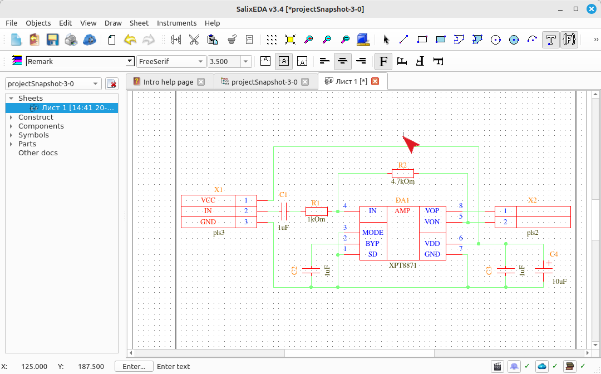

Type the line characters.

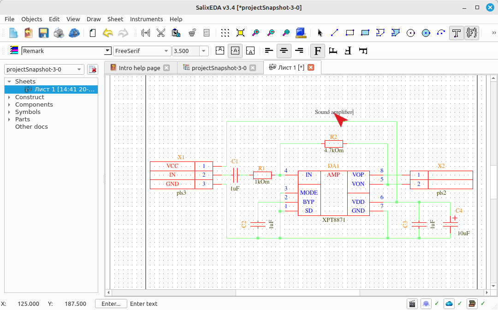

Press Enter or the left mouse button to finish input.

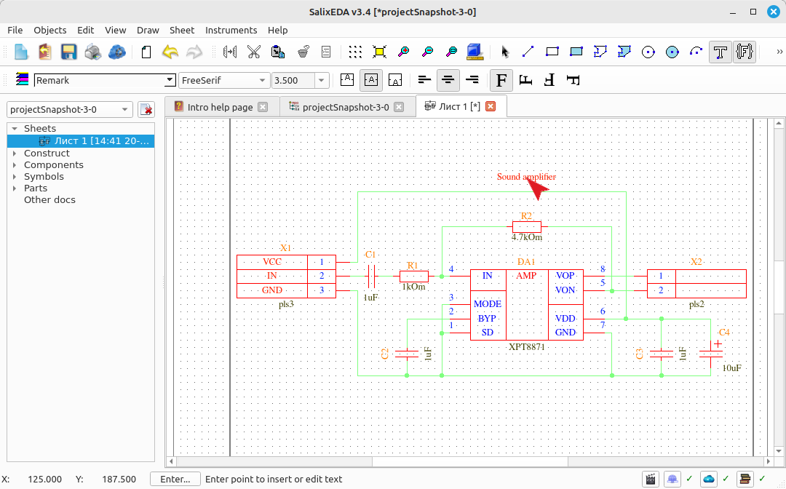

Hover the mouse over the location where the next line will be placed and press the left mouse button. Type the line characters.

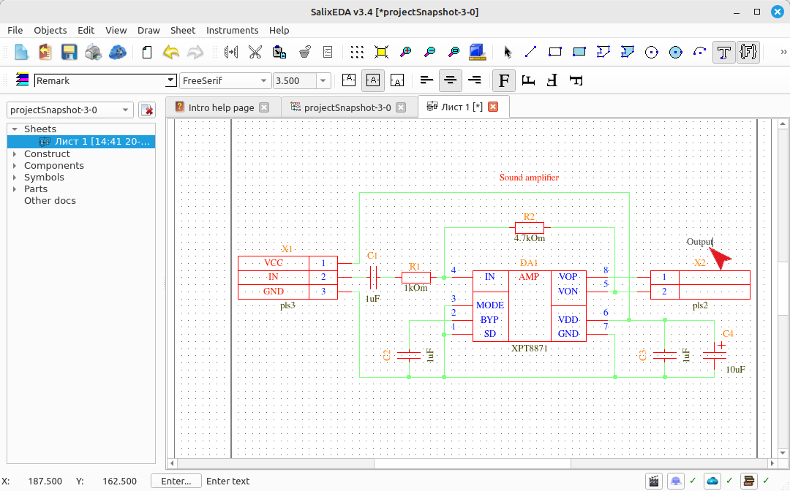

Press Enter or the left mouse button to finish input.

## Exiting text input mode
To exit text input mode, press the right mouse button. This returns
to edit mode.

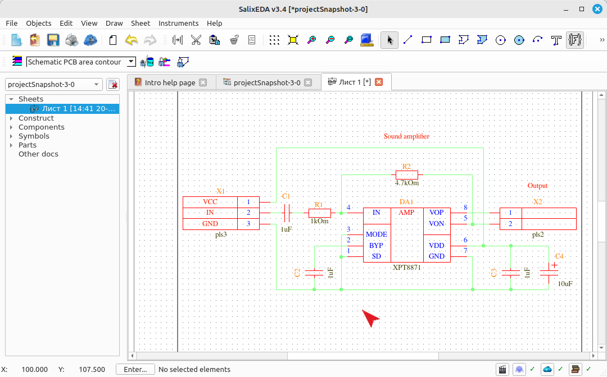
