<!--Prev insertNet--> <!--Next createPcb-->
<!--Zoomed true-->
# Заключительное оформление схемы

## Ренумерация
Для идентификации компонентов, каждый из них содержит уникальный идентификатор
в пределах одной платы. SalixEDA может расставлять эти идентификаторы автоматически.
В меню Схема выберите пункт Ренумерация.

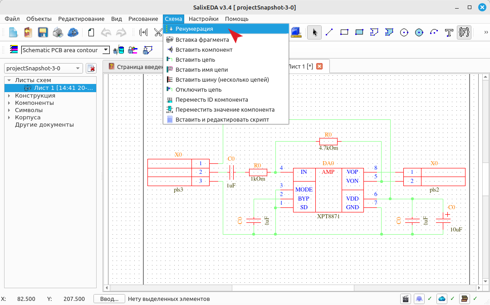

При этом SalixEDA назначит компонентам идентификаторы в соответствии с правилами,
определенными в настройках. По умолчанию используются правила ГОСТ: сверху вниз и
слева направо.

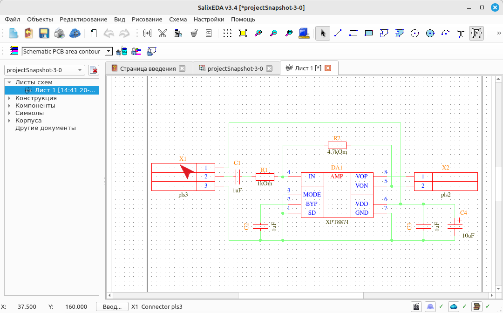

## Включение режима ввода текста
Часто на схеме требуется нанести текстовые пометки. Для этого служит режим ввода текста.
Чтобы включить режим ввода текста нажмите на такую кнопку.

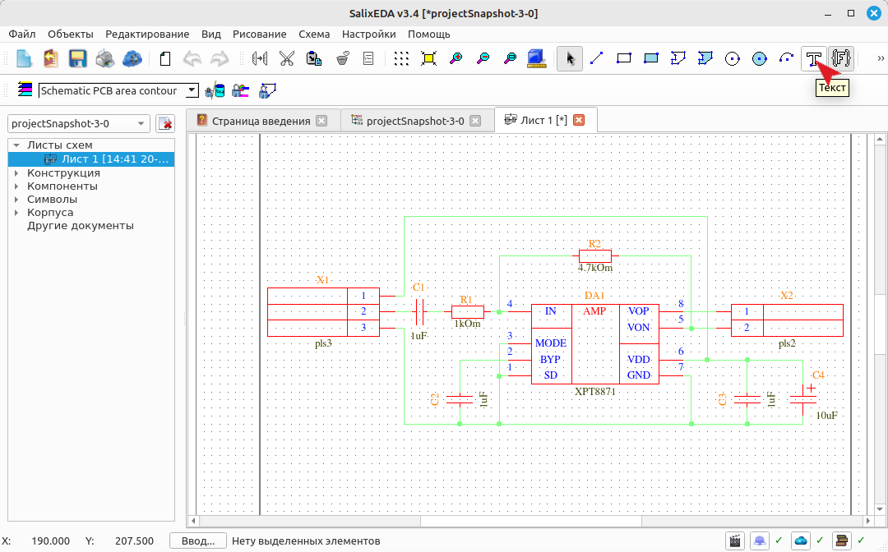

## Использование режима ввода текста
Текст представляет собой одну строку символов. Для ввода такой строки наведите мышь 
на место, где будет расположена эта строка и нажмите левую кнопку мыши. Включится
ввод символов, а место ввода будет обозначено вертикальной черточкой.

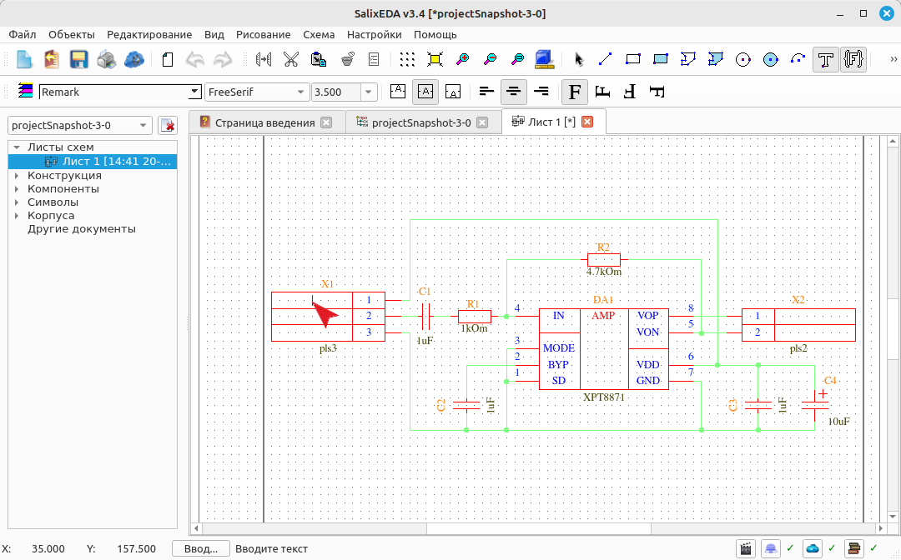

Вводите символы с клавиатуры.

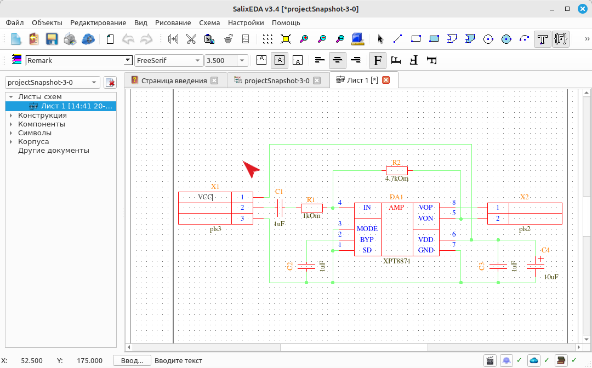

По завершению ввода строки нажмите Enter или левую кнопку
мыши.

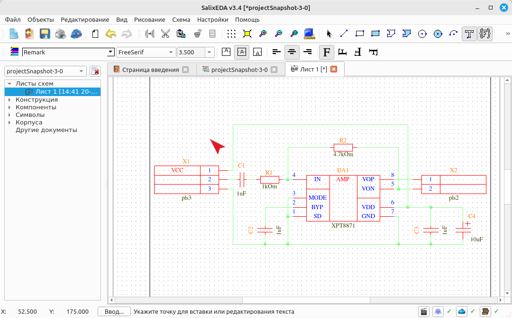

Наведите мышь на место, где будет расположена следующая строка и нажмите левую кнопку
мыши. Введите символы строки.

Нажмите Enter или левую кнопку мыши для завершения ввода. 

Наведите мышь на место, где будет расположена следующая строка и нажмите левую кнопку
мыши. Введите символы строки.

Нажмите Enter или левую кнопку мыши для завершения ввода. 

Наведите мышь на место, где будет расположена следующая строка и нажмите левую кнопку
мыши. 

Введите символы строки.

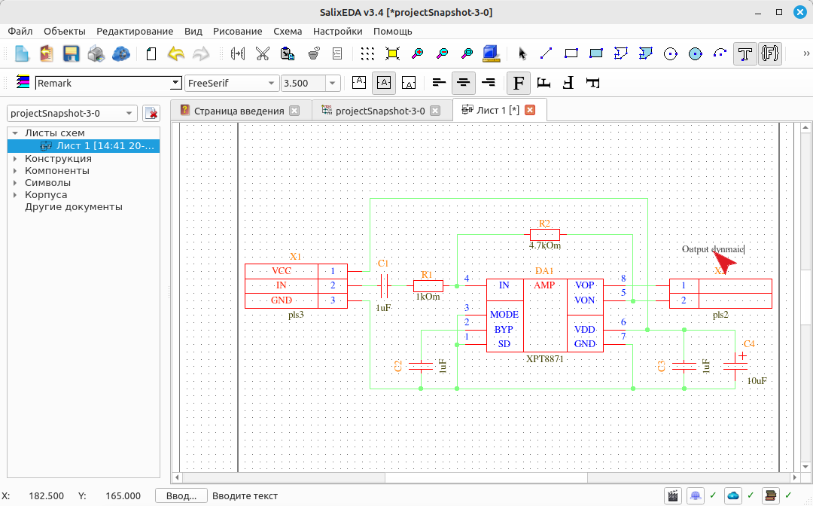

Нажмите Enter или левую кнопку мыши для завершения ввода. 

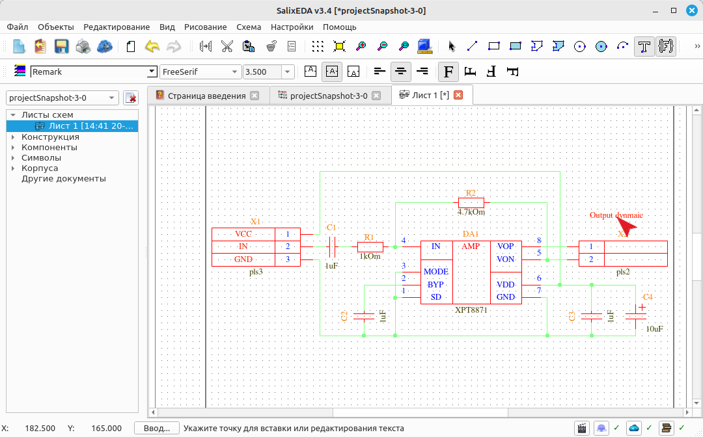

Наведите мышь на место, где будет расположена следующая строка и нажмите левую кнопку
мыши. Введите символы строки.

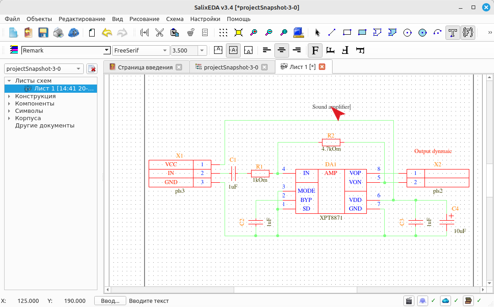

Нажмите Enter или левую кнопку мыши для завершения ввода. 

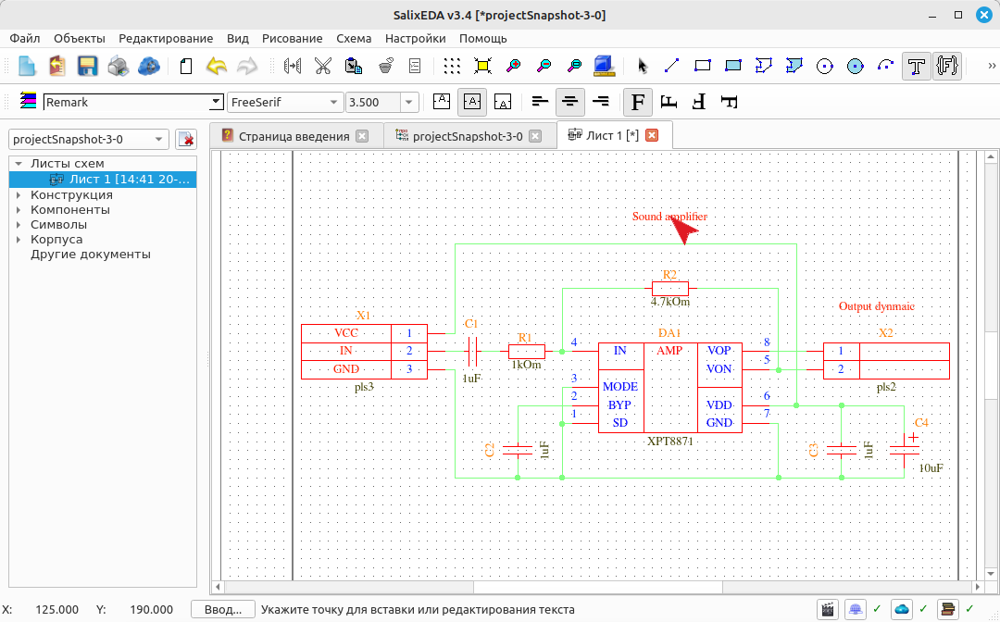

## Завершение режима ввода текста
Чтобы завершить режим ввода текста нажмите правую кнопку мыши. При этом возвращается
режим редактирования.

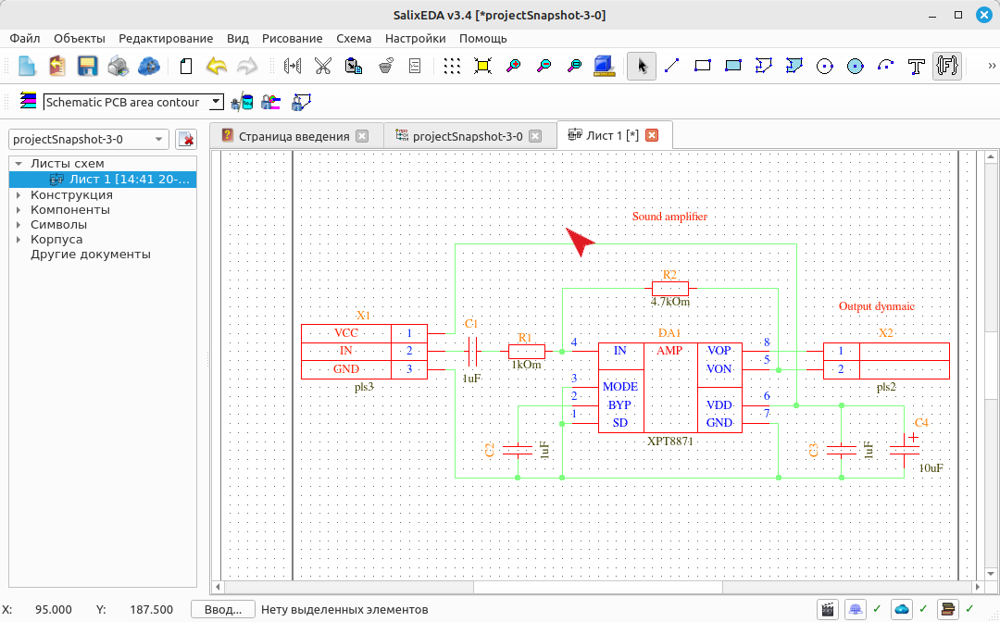

